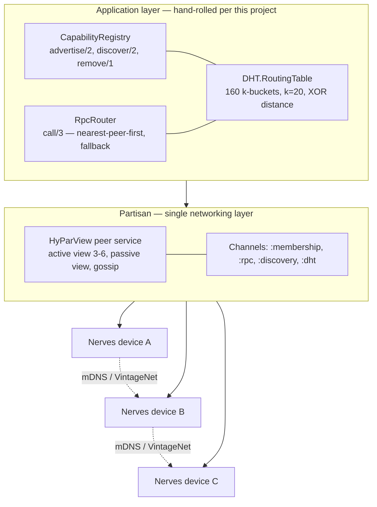
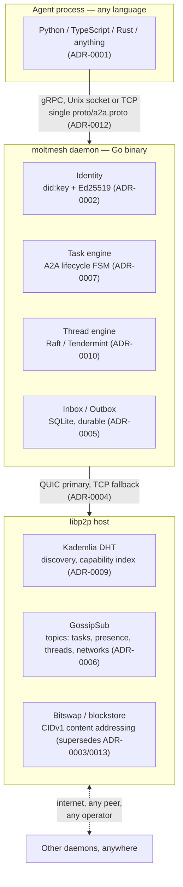

# The Architecture of OpenMolt Network

### Origins, Decisions, and the Distance Between Design and Implementation

*A dissertation on the design history of a peer-to-peer agent-to-agent communication protocol, from its Elixir/Partisan prototype through its Go/libp2p rewrite, cross-examined against the system as it is actually built — read, throughout, as both an engineering journey and a business problem: what a network for AI agents is actually for, and what it costs a team when its own design record stops telling the truth about its code.*

---

## Abstract

Two problems motivate this dissertation, and neither is academic for its own sake. The first is the business problem OpenMolt Network itself exists to solve: today, an AI agent that wants to hire another agent for a task has to go through somebody's platform — a hosted registry, an API gateway, a marketplace that takes a cut — because no open, language-agnostic protocol lets agents discover, negotiate with, and pay each other directly. That is the same shape of problem every peer-to-peer network before it has solved for humans (file-sharing, messaging, payments), applied here to autonomous software agents instead: build the discovery, identity, and settlement layer once, and let anyone plug in, without asking a platform's permission or paying its toll. This dissertation reconstructs the design history of what is now called OpenMolt Network (binary name `moltmesh`, repository name `p2p-a2a`) — a peer-to-peer protocol that lets AI agents built in any language discover one another, delegate tasks, stream results, and share ordered, replicated logs, without a central server. The system did not begin as it stands today. It began as a pure-Elixir mesh built on Partisan, targeting embedded Nerves devices on a local network, with a hand-rolled Kademlia DHT for capability discovery. That prototype was abandoned, and the project was rewritten from first principles in Go on top of libp2p, guided by nineteen Architecture Decision Records (ADRs) that document the reasoning behind each subsequent choice: identity, transport, messaging durability, task semantics, capability discovery, consensus, encryption, and concurrency.

The second problem is quieter, and just as costly to any business that would eventually have to stake money, uptime, or a security audit on this kind of infrastructure: what happens to a team's design record while the team is busy shipping. The distinctive contribution of this document is not a restatement of the nineteen ADRs. It is a reconciliation of what they *say* against what the code *does*, established by direct inspection of the working tree rather than by trusting the documentation record — the same check an acquirer's diligence team, a security auditor, or a new engineer's first week would eventually have to run anyway, done here deliberately and in advance rather than discovered under deadline pressure. That reconciliation surfaces a pattern common to any system that evolves faster than its own paper trail: some decisions were implemented exactly as recorded; some were implemented and then quietly reversed within days, leaving a written rationale that argues against the code that now exists; some were generalized into simpler, better designs than the diagrams show; and some load-bearing parts of the system — a session-authentication boundary, a task-leasing subsystem, a terminal UI, a second daemon entrypoint — were built with no ADR at all. None of this is a story of neglect. It is the ordinary residue of real engineering, and treating it honestly is worth more to the business than treating the ADR set as a specification the code obeys.

The dissertation opens with a single chapter recovering the Elixir-era prototype built before this repository existed — the earlier attempt at the same problem, and the open questions its own specification admitted it could not answer, including a brief accounting of which of those questions the Go rewrite went on to resolve. From there it stays in the present system, but rather than working chapter-by-chapter through nineteen ADRs in the order they were written, it follows the system the way a new engineer — or a curious counterparty's due-diligence engineer — would actually explore it: how an agent proves who it is, how it finds a stranger capable of doing something, how a group of agents keep a shared log straight, how work actually moves from one agent to another, why none of that collapses the moment a stranger turns out to be adversarial, what runs it all under the hood, what carries the bytes, and what survives when something breaks. Every claim along that tour is checked against the same three sources — code, git history, and the ADRs themselves — and every place they disagree is reported as a finding, collected at the end into a single catalog, followed by what should happen next.

---

## Chapter 1 — Introduction and Method

### 1.0 Why this document exists

Start with the business problem, because everything that follows is downstream of it. If you want two AI agents built by different teams, in different languages, to find each other and do business — one delegates a task, the other completes it and gets paid — there is currently no neutral wire on which that can happen. There are hosted platforms that will broker it for a fee, and there are ad-hoc integrations between whichever two frameworks happen to already know about each other. Neither is a protocol. OpenMolt Network's entire reason for existing (see the project's own README, "What this is not": no platform owns discovery, routing, or the marketplace) is to be the thing underneath both of those options — the layer a business could build a product on without first negotiating terms with whoever owns the registry. That is the product-level business problem this whole codebase is an attempt to answer, and it is worth stating plainly before diving into ADRs and Go source, because it is easy for an architecture audit to lose sight of the fact that the architecture is in service of something specific: a labour market for autonomous agents that no single company can rent-seek on.

What that actually looks like, concretely, is a daemon — `moltmesh-daemon`, one Go binary — that any agent, in any language, talks to over gRPC on a local socket. The daemon does the hard networking: it proves the agent's identity to the rest of the network, advertises what the agent can do, finds other agents by what *they* can do, delivers messages and tasks to them directly over an encrypted peer-to-peer connection, and keeps a durable, replicated record of anything that needs one. Chapters 4 through 11 of this dissertation are a guided tour through exactly those pieces, in the order an agent would actually encounter them: prove who you are, find someone, coordinate with them, hand them work, trust that none of it gets tampered with, and survive whatever goes wrong along the way.

There is a second, smaller business problem sitting inside the first one, and it is this dissertation's actual subject. Building that kind of infrastructure means making dozens of consequential decisions — how identity works, which consensus algorithm a business can trust its data to, how encryption keys rotate — and writing them down as ADRs so that a future engineer, an investor's technical diligence, or a security auditor can understand *why* the system looks the way it does without having to reverse-engineer it from source. That written record has real value only as long as it stays true. The moment it silently diverges from the code — a decision reversed without anyone updating the document that argued for the position now abandoned — the ADR set stops being an asset and starts being a liability: it actively misleads exactly the people (new hires, auditors, acquirers) who trusted it most. Nobody sets out to let that happen. It happens because shipping is always more urgent than bookkeeping, in every engineering organization that has ever existed, this one included. The question this dissertation actually investigates is not "is this project well-architected" — it is "does this project's paper trail still tell the truth, and where exactly does it stop."

Every nontrivial software system accumulates two histories. One is the history recorded in commit messages, design documents, and — where a project is disciplined enough to keep them — Architecture Decision Records. The other is the history embedded in the code itself: the imports actually present, the schemas actually executed against a live database, the message types actually reachable from a running binary. These two histories usually agree closely at the moment a decision is written down and diverge steadily afterward, because code keeps changing after the prose that justified it stops being edited. An ADR is, definitionally, a record of a decision at a point in time — not a continuously maintained specification. Nothing about the ADR format guarantees currency, and nothing about a fast-moving prototype guarantees that every subsequent change gets its own record.

This project is a clean specimen of that pattern, because it kept unusually good written records (nineteen ADRs, an `ARCHITECTURE.md`, a `docs/adr/README.md` index of open questions) while simultaneously moving fast enough that at least two of those records were falsified by code committed within twenty-four to forty-eight hours of their acceptance. That combination — rich documentation, rapid divergence — is exactly the condition under which a naive dissertation ("here is what the ADRs say the system is") would be actively misleading. So the method used here is different. Every architectural claim made in this document was checked against one of three sources, in this order of authority:

1. **The current working tree** — the actual Go source, including uncommitted changes on the `actor-model` branch, is the ground truth for "what the system does now."
2. **The Git history** — used to establish *when* a design changed and what commit reversed or superseded an ADR's stated position.
3. **The ADRs and `ARCHITECTURE.md`** — used for the *reasoning*, the alternatives considered, and the intent behind a decision, which the code alone cannot recover.

Where these three sources agree, the ADR is treated as an accurate and sufficient description and cited directly. Where they disagree, the disagreement is reported as a finding in its own right, with the specific file, function, or line responsible, because the disagreement is itself part of the system's history and arguably the more interesting part. It is also, in business terms, exactly the part that matters most: nobody doing diligence on this project needs to be told that ADR-0002 is accurate — they need to be told, specifically, that ADR-0010 argues against a dependency the code actually ships, because that is the sentence that would otherwise cost someone a bad afternoon in a design review.

### 1.1 How this dissertation is organized

Chapter 2 recovers the project's Elixir-era predecessor from its own internal specification documents — which the Go-era ADRs never reference and which exist nowhere in this repository's Git history, since they predate it entirely — and closes by checking its seven recorded open questions against what the Go system actually shipped, so that origin story is contained in one place rather than threaded through the rest of the document. Chapter 3 explains the pivot to Go and libp2p as a deliberate widening of scope, not a simple technology swap, and from there the dissertation stays in the present system for the rest of its length.

Chapters 4 through 11 are the guided tour, and they are ordered the way the system actually gets used, not the way its ADRs happen to be numbered: **Identity** (Chapter 4, how an agent proves who it is), **Discovery** (Chapter 5, how a stranger finds it), **Threads** (Chapter 6, how a group of agents keep a shared log straight), **Task Delegation** (Chapter 7, how work actually moves from one agent to another), **Trust** (Chapter 8, why none of the above collapses the moment a peer turns out to be adversarial), **Concurrency** (Chapter 9, the actor model, presence, the outbox, and GossipSub that carry every one of the previous chapters under the hood), **Transport** (Chapter 10, what is physically carrying the bytes), and **Durability** (Chapter 11, what survives a crash, an offline peer, or a reboot at the worst possible moment). Chapter 7 additionally covers a cluster of three ADRs (0017–0019) accepted on 2026-08-19, after this dissertation's initial code audit, that retroactively close several of the gaps that audit had flagged, folded into whichever of the topical chapters they actually belong to rather than treated separately. Chapter 12 collects the accumulated divergences from Chapters 4 through 11 into a single catalog. Chapters 13 and 14 cover future work and conclusions.

---

## Chapter 2 — Origins: The Elixir/Partisan Capability Mesh

Every version of this project has started from the same personal itch: autonomous agents that cannot find or delegate to each other are not very autonomous. The first attempt at scratching that itch predates this repository entirely, and it is worth telling honestly rather than skipping past, because the decisions that look obvious in the Go rewrite (Chapter 3 onward) were not obvious the first time — they were earned by building something else first, watching it hit a ceiling that had nothing to do with code quality, and setting it aside.

### 2.1 What the prototype was

Before this repository existed, the same problem — how do autonomous peers advertise what they can do, find each other by capability across a sparse network, and route requests to the nearest capable peer — was attacked in Elixir. The project, internally named `ElixirRpc`, targeted **Nerves**, the embedded-systems Elixir framework used to build firmware for physical devices. Its own specification document, "P2P Capability-Based RPC Specification (Partisan)," frames the problem in almost the same words the later Go `ARCHITECTURE.md` uses for OpenMolt Network: advertise capabilities over a sparse network, discover nearest peers with required capabilities by hop count, route requests to capable peers, and — optionally — triangulate approximate location from anchor nodes. That continuity of problem statement, independent of the total discontinuity of implementation technology, is the single fact that makes this dissertation's central comparison possible: the two systems are not similar by accident, they are the same design problem attacked twice, six or more years of ecosystem maturity apart in the author's own hands.

`ElixirRpc` had a companion document, "Partisan P2P Mesh Networking Setup," which describes the system as actually built rather than only specified: a Nerves `Application` that starts a **Partisan** peer service before the rest of the application (`lib/elixir_rpc/application.ex`), a `PartisanConfig` module exposing `join_peer/1`, `members/0`, `send_message/2`, and `broadcast/2`, and a `PeerManager` that integrates with Nerves' `VintageNet` to detect network interface changes and re-trigger discovery. This was not a paper design; it had running code, a documented multi-node testing procedure (`iex --sname node1 -S mix` / `iex --sname node2 -S mix`), and a troubleshooting section for real failure modes (port conflicts, firewalled UDP, HyParView tuning). It is worth stating plainly at the outset: the Elixir prototype was a serious, working system, not an abandoned sketch. Understanding why it was still set aside is the point of this chapter.

### 2.2 Single-layer design: Partisan as the whole networking stack

The architectural decision at the center of the Elixir system was to use exactly one networking layer — **Partisan** — for everything: peer membership, overlay topology, message broadcast, and failure detection. Partisan's `HyParView` peer service manager gives each node a small **active view** (3–6 direct TCP connections, configurable via `min_active_size`/`max_active_size`) and a larger **passive view** of additional known-but-unconnected peers, maintained by periodic gossip (`periodic_interval`) and used for failover when an active connection dies. This is a genuine partial-mesh design: O(log N) connections per node rather than the O(N²) of a full mesh, with self-healing on partition recovery through the same gossip mechanism that maintains membership. On top of that single transport layer, the specification lays a second, purpose-built layer: a **Kademlia-style DHT**, implemented from scratch in Elixir, for capability storage and lookup.

The DHT design in the specification is a textbook Kademlia: 160 k-buckets per node (one per bit of a SHA-1 node ID), each holding up to `k = 20` peers, with `FIND_NODE`/`FIND_VALUE`/`STORE`/`PING` message kinds sent as Partisan messages over a dedicated `:dht` channel. Capabilities — plain atoms like `:compute`, `:storage`, `:relay`, `:anchor`, or key-value tag maps like `%{gpu: "nvidia", memory: "32GB"}` — are advertised by hashing a canonical string (`"capability:compute"`) with SHA-1 to produce a DHT key, then storing a signed-looking (though not actually cryptographically signed — see §2.4) value record on the three nodes closest to that key by XOR distance (`@replication_factor 3`). Discovery inverts the same operation: hash the capability name, find the closest nodes, collect their stored records, sort candidates by estimated hop count. The specification's own worked memory calculation is a genuinely good piece of systems thinking: a 1,000-node network needs roughly 4 KB of routing-table state, 5 KB of local capability records, and 15 KB of replicated DHT entries per node — about 25 KB total, compared to an estimated 5 MB for a CRDT-based alternative the author had evidently also considered and rejected. That is a 200× reduction, and it is exactly the kind of resource-constrained thinking a Nerves/embedded target demands.

*Figure 2.1 — The Elixir/`ElixirRpc` stack: one transport layer (Partisan/HyParView) carrying one hand-rolled application layer (Kademlia DHT plus capability registry and RPC router), targeting Nerves devices discovered over mDNS on a LAN.*

### 2.3 The capability model: atoms and tags

The Elixir specification's capability model has two tiers in embryo, though it never uses that word. A capability can be a bare atom (`:compute`) — coarse, exact-match, DHT-indexed — or a tagged map (`%{type: :compute, tags: %{gpu: "nvidia", memory: "32GB"}}`) carrying arbitrary key-value refinement. The `CapabilityRegistry` module's public API — `advertise/2`, `discover/2`, `remove/1` — is deliberately small, and `discover/2` already sorts results by an estimated hop count derived from XOR distance, capping the result set to a caller-supplied `limit`. This is worth stating precisely because it is the direct conceptual ancestor of the two-tier capability schema verified in Chapter 4: a small, DHT-indexed core vocabulary for coarse routing, plus free-form refinement that is not exact-match-searchable. The idea did not originate in the Go rewrite. It originated here, informally, as an atom/tag split, and was formalized later.

### 2.4 What the specification admitted it did not know

The single most valuable section of the Elixir specification, for the purposes of this dissertation, is its closing "Open Questions" list — seven items the author recorded as unresolved at the time the document was written:

1. *XOR distance accuracy*: is XOR distance a good enough proxy for real network hop count, or should the system measure actual latency instead?
2. *Capability TTL*: is a flat two-hour default reasonable, or should TTL be configurable per capability?
3. *DHT churn*: how should the system handle nodes joining and leaving frequently?
4. *Bucket refresh*: how often should k-bucket peers be pinged to detect failure?
5. *Partition handling*: what happens during network splits — should the system adopt vector clocks?
6. *Security*: node authentication, message signing, capability validation — all explicitly unaddressed.
7. *Tag matching*: should tag queries support ranges or patterns (e.g. `memory: > 16GB`)?

Item 6 deserves emphasis on its own. The specification's DHT `STORE`/`FIND_VALUE` protocol, as written, has no signature field anywhere in its message formats, and no authentication step in `DHT.Bootstrap.join/1`. Any node that joins the Partisan mesh — which itself auto-joins any peer that answers on the configured port — can store arbitrary capability records under any key, including records claiming to be advertised by a different node. The specification's own author flagged this as open rather than glossing over it, which is exactly the kind of honesty an ADR-writing culture is supposed to encourage, and it is why this dissertation treats the Elixir document as a serious engineering artifact rather than a toy. §2.7, at the end of this chapter, checks all seven items against the Go system as it exists today — and, on item 6 specifically, against a signature-verification layer (Chapter 8) that turns out to be considerably stricter than anything the prototype's own author had time to build.

### 2.5 The Nerves constraint and its consequences

It is easy to read the Elixir specification as "the same problem, an earlier attempt, worse tools." That undersells it. The system was built for **Nerves** — physical embedded devices, discovered on a LAN via `mdns_lite` and the project's own `MdnsAdvertiser`/`PeerDiscovery` modules, joined to the mesh automatically via `NervesDiscovery` scans every 15 seconds, with network-interface change events routed through `VintageNet`. That is a fundamentally different deployment target than an internet-scale network of AI agents run by mutually untrusting operators. A LAN of devices under one administrative domain has a trust model, a churn pattern, and a security posture that a global agent-to-agent network does not share. Several of the specification's open questions — bucket refresh cadence, DHT churn handling — are hard operational-tuning problems on a WAN and comparatively tractable ones on a stable LAN where most nodes are physically co-located and administered by one party. The rewrite in Go was not merely a language change; it was a widening of the deployment envelope from "devices I administer on my network" to "any agent, anywhere, built by anyone." That widening is the actual subject of Chapter 3.

### 2.6 What carried over

Despite the total change of language, runtime, and transport, four ideas from the Elixir prototype survive essentially intact in the current system, and it is worth naming them before moving on, so that the rewrite reads as an evolution rather than a repudiation:

- **The two-part discovery architecture** — a distance-metric-ordered structured overlay (Kademlia then, libp2p's Kademlia DHT now) layered under an application-level capability index — survives as the entire shape of Chapter 5.
- **The atom/tag capability split** survives as the Tier-1/Tier-2 schema verified in Chapter 4.
- **Store-and-forward reasoning for offline peers**, though never fully specified in the Elixir document beyond DHT replication, survives as the explicit design question answered in Chapter 9.
- **Broadcast/subscribe as a first-class primitive** (`Broadcast.broadcast/2`, `Broadcast.subscribe/2` over Partisan channels) survives as GossipSub topic pub/sub, also Chapter 9.

What did not survive: the single-layer "pure Elixir, no libp2p, no Rust" constraint stated explicitly in the specification's own Requirements section. The Go rewrite adopts libp2p as its single networking layer in exactly the role Partisan played — and, within days of the earliest ADRs, adopts IPFS's Bitswap and Kademlia DHT libraries on top of it, reversing the analogous "no IPFS" decision the new project itself had just made (Chapter 5, §5.1, and Chapter 11, §11.1). The instinct to keep the dependency surface minimal is a constant across both eras of this project; both times, that instinct lost to the pull of a more mature, battle-tested library once one became available in the target language. That is a pattern this dissertation will name explicitly in Chapter 12, because it recurs at least three more times in the Go-era ADR record — and recognizing it now, rather than the third time it happens, is one of the few genuine advantages of having built the same kind of system twice.

### 2.7 What became of the seven open questions

This chapter opened with seven questions the Elixir specification admitted it could not answer (§2.4). The rest of this dissertation verifies the Go system in detail without further reference back to Elixir; this section closes the loop once, briefly, so that comparison stays contained in this one chapter rather than resurfacing throughout.

| # | Elixir open question | What the Go system did | Where |
|---|---|---|---|
| 1 | Is XOR distance a good enough hop-count proxy? | Sidestepped — the dependent feature (hop-count-sorted results) was never built; XOR distance is used only for DHT routing-table structure. | Ch. 5 §5.1 |
| 2 | Flat vs. per-capability TTL? | Resolved differently: DHT provider-record expiry plus 30s GossipSub presence heartbeats — a push-refresh model, not a pull-TTL model. | Ch. 9 §9.2 |
| 3 | How to handle DHT churn? | Delegated to libp2p's Kademlia DHT implementation, matured over years of IPFS production use. | Ch. 5 §5.1 |
| 4 | How often to ping k-buckets? | Same delegation as (3); never re-litigated in any Go-era ADR. | Ch. 5 §5.1 |
| 5 | Vector clocks for partitions? | Resolved more strongly: switchable Raft/Tendermint per thread, chosen by the participants' actual trust relationship, later extended to survive partitions during membership changes specifically. | Ch. 6, Ch. 8 §8.3 |
| 6 | Security — auth, signing, validation? | The sharpest gap in the prototype; the most thoroughly resolved question in the rewrite — `did:key` identity, Ed25519 signing everywhere, DHT-record validators that reject forged or expired Agent Cards outright, encrypted thread payloads, and a recovery-secret mechanism closing the one corner (thread-history recovery) the prototype never had to solve. | Ch. 4, Ch. 8 |
| 7 | Range/pattern tag matching? | Still open, in both eras. Tier-2 capability tags remain exact-match strings in both systems. | Ch. 13 (Future Work) |

Five of seven were resolved, two of those substantially better than the Elixir author could have built for that runtime and deployment target; two were resolved by delegating to a mature dependency rather than by original design; one was sidestepped by not building the dependent feature; one remains genuinely open. That is the entire payoff of this chapter, and the rest of this dissertation does not need to return to it.

---

## Chapter 3 — The Pivot: Why Go, Why libp2p

### 3.1 The language-homogeneity ceiling

The Elixir prototype's single-language distribution model (§2.2) was airtight within a fleet of devices running the same firmware and useless for a network whose entire purpose is to let AI agents "built in any language or framework (Python, TypeScript, Rust, Java, etc)" (ADR-0001's own words) talk to one another. ADR-0001 lists "native library per language" as the first of three alternatives and rejects it outright, on the grounds that the core networking layer is complex and "should not be reimplemented per language" — the direct lesson of a single-language mesh being a mesh only that language's agents can join.

The solution ADR-0001 adopts is the one Erlang-style distribution and libp2p-style daemon architectures converge on independently when this problem is posed generally: put the hard networking logic in one process, expose it over a narrow, language-neutral interface, and generate thin client stubs for every language from a single schema. ADR-0001 chooses gRPC over Unix socket (local) or TCP (remote), with SDKs auto-generated from one `.proto` file — verified in the current source at `daemon/rpc/server.go:53`, where a single `A2ANode` gRPC service is registered, and in `cmd/daemon/main.go` and `cmd/moltmesh/daemon.go`, both of which wire up the Unix-socket-plus-TCP listener pair the ADR specifies. (That the daemon-bootstrap logic exists in near-duplicate form across two separate command entrypoints — undocumented in any ADR — is itself a finding taken up in Chapter 12.)

### 3.2 A second influence: Pilot Protocol

ADR-0001, ADR-0002, and ADR-0004 each cite a system called **Pilot Protocol** as prior art, credited in `ARCHITECTURE.md`'s "Prior Art & Influences" table with "Daemon + IPC model, binary transport, zero-setup DX, domain groups." ADR-0001 states it directly: "Pilot Protocol proved this model works at 230k agents. Single static binary, zero setup." ADR-0002 cites its virtual-address identity scheme (`N:NNNN.HHHH.LLLL`) as an alternative considered and rejected in favor of `did:key`. ADR-0004 cites its choice of "UDP with a custom reliable streaming layer" and a measured 12-second-versus-51-second query-resolution improvement over TCP as precedent for choosing QUIC. Pilot Protocol is referenced only as prior art in this repository — no specification for it exists here, and this dissertation makes no claim about its internals beyond what the ADRs themselves state. What matters for this chapter is structural: the Go rewrite drew on two independent precedents simultaneously — the author's own Elixir prototype, which supplied the problem statement and the discovery architecture, and Pilot Protocol, which supplied evidence that a language-agnostic daemon model scales to hundreds of thousands of agents in production. Neither alone would have justified the rewrite; together they did.

### 3.3 Reframing the trust model

The deepest change the pivot makes is not technical but adversarial. An internet-scale network of agents run by unrelated organizations has to assume any peer might be hostile — a LAN of devices under one operator, the prototype's target, did not (§2.5). ADR-0008's rationale states the new assumption plainly: "Remote agents will send malformed, oversized, or adversarial messages. Tasks must be crash-isolated." Every subsequent chapter of this dissertation touches a decision that traces back to this one reframing: identity becomes self-sovereign and cryptographically verifiable rather than an unauthenticated node name (Chapter 4); consensus backends are chosen per-thread based on whether participants are cooperative or adversarial (Chapter 6); actor supervision exists specifically to contain damage from a hostile peer's malformed input (Chapter 9); and Chapter 8 is, in effect, the sustained answer to this one sentence. This is also where the product-level business problem from §1.0 and the engineering decisions in this repository actually meet: a marketplace where strangers' agents pay each other for work (README, "Payments & Task Marketplace") is only a viable business if the underlying network already assumes every counterparty might be adversarial. A LAN-scale trust model bolted onto a payments feature later would not be a retrofit — it would be a rewrite of exactly the kind this project has already been through once.

### 3.4 The system that resulted

Five ADR-backed subsystems came out of the reframing in §3.1–3.3: a language-neutral gRPC daemon (ADR-0001), self-sovereign `did:key` identity (ADR-0002), a QUIC-primary libp2p transport (ADR-0004), a two-tier capability schema over the Kademlia DHT (ADR-0009), and switchable per-thread consensus (ADR-0010). Figure 3.1 shows how they fit together; each is verified against source in the chapters that follow — identity and capability in Chapter 4, discovery in Chapter 5, consensus in Chapter 6, and transport in Chapter 10.

*Figure 3.1 — The Go/libp2p stack: one language-neutral daemon behind a narrow gRPC interface, layered over a single, mature P2P substrate shared with the wider IPFS ecosystem.*

---

## Chapter 4 — Identity: Proving Who You Are on an Open Network

Everything from here on assumes an agent already has two things: a way to prove who it is, and a way to say what it can do. This chapter is where both of those get built, and it is the chapter Chapter 2's open question 6 — security, left almost entirely unaddressed in the prototype — points straight at.

### 4.1 ADR-0002 — `did:key` identity (verified: matches exactly)

ADR-0002's decision — derive a W3C `did:key` DID directly from an Ed25519 public key, with no registry, so that "the key IS the document" — is implemented precisely as specified. `daemon/identity/identity.go` constructs the DID as `did:key:z<base58btc(0xed01 || pubkey)>`, the standard multicodec prefix for Ed25519 public keys, and exposes `Sign`/`Verify` operating directly on raw Ed25519 signatures. This is the cleanest resolution in the entire ADR record of one of the prototype's open questions (§2.4, item 6): node identity is no longer an unauthenticated node name but a self-certifying, portable, non-revocable public key, exactly matching ADR-0002's stated rationale (self-sovereign, portable, verifiable, no issuer). The ADR's own stated limitation — key rotation breaks the DID, "reserved for ADR-0002a" — remains unresolved; no ADR-0002a exists in the current index, and this dissertation records that as an open item rather than a resolved one (see Chapter 13).

### 4.2 One key, two identifiers: DID and libp2p peer ID

A detail no ADR states outright, but that direct inspection confirms: an agent's `did:key` and its libp2p peer ID are not two independent identity systems bolted together — they are the same Ed25519 key material, worn two ways. `daemon/identity/identity.go` builds a `LibP2PKey crypto.PrivKey` field alongside the DID at load time, from the identical keypair; `daemon/node/node.go:97` passes that same key directly into `libp2p.Identity(id.LibP2PKey)` when the host is constructed. The DID is a multibase encoding of the public key, used at the application layer for signing Agent Cards, thread entries, and GossipSub messages; the libp2p peer ID is a hash of that same public key, used at the transport layer for routing. Nothing here can drift independently — there is no scenario where an agent's network-routing identity and its application-level identity disagree, because forging one would require forging the other's underlying key.

### 4.3 The Agent Card: a signed statement of what you offer

Proving identity only gets an agent halfway to being useful on the network; the other half is saying what it can *do*. `ARCHITECTURE.md`'s own description — a protobuf/JSON document carrying the agent's DID, its libp2p multiaddresses, its public key, and its list of capabilities, signed and periodically re-published (every five minutes by default) — is corroborated by the DHT-record validator inspected in Chapter 8, which independently confirms the exact field set (`Did`, `PublicKey`, `PublishedAt`, `ExpiresAt`, `Signature`) a valid card must carry. The signing discipline is not optional or best-effort: as Chapter 8 shows, every honest peer in the network refuses to store a card whose signature doesn't verify against the public key encoded in its own DID, which means an Agent Card cannot be forged by anyone who doesn't hold the private key it claims to speak for.

### 4.4 ADR-0009 — the two-tier capability schema: structurally intact, lexically drifted

ADR-0009's two-tier design — a small, versioned, DHT-indexed core ontology (`a2a:v1:cap:*`) plus free-form, non-indexed Tier-2 namespaced tags visible only in the Agent Card — is present in the code exactly as structured. `pkg/capability/capability.go` implements the same `a2a:v<version>:cap:<name>` canonical format the ADR specifies. What has drifted is the *content* of the core vocabulary. ADR-0009 lists ten names: `text-generation, code-execution, web-retrieval, image-generation, data-analysis, file-processing, tool-use, embedding, speech-to-text, text-to-speech`. The implemented constant list is: `text-generation, code-execution, image-analysis, file-processing, data-retrieval, task-orchestration, voice-synthesis, search`. Only three names — `text-generation`, `code-execution`, `file-processing` — survive verbatim. `web-retrieval` became `data-retrieval`/`search`; `image-generation` became `image-analysis` (a meaningfully different capability, analysis rather than generation); `tool-use`, `embedding`, `speech-to-text`, and `text-to-speech` were dropped entirely; `task-orchestration` and `voice-synthesis` were added with no ADR amendment recording either the additions or the removals. The versioning scheme (`a2a:v1:cap:*`, with a documented `a2a:v2:cap:*` escape hatch for breaking changes) is present but has never been exercised — the vocabulary changed underneath the same version number the ADR designed specifically to avoid that.

This is, structurally, the same organic vocabulary drift the prototype's open question 7 half-anticipated (§2.7, item 7). Making the *core* vocabulary small and versioned rather than open-ended is the right structural fix — but a structural fix does not, by itself, prevent the *contents* of a small versioned list from drifting without anyone updating the document that names them. The lesson generalizes: versioning a schema and disciplining a schema are different problems, and this project solved the first without fully solving the second.

With a DID, a peer ID that's secretly the same key, a signed Agent Card, and a capability vocabulary to describe itself in, an agent is now a nameable, findable, provably-itself participant in a network with no membership office. The next question is how anyone actually finds it.

---

## Chapter 5 — Discovery: Finding a Stranger Who Can Do the Work

An agent with an identity and nothing else is invisible. This chapter is about the mechanism that makes it findable — not by a directory, but by the same DHT its Agent Card just got published to.

### 5.1 ADR-0003, and the discovery substrate it reversed into

ADR-0003, dated 2026-05-30, originally decided that v1 uses "plain libp2p only. No IPFS, no Kubo, no Boxo dependency," deferring any IPFS integration to "v2." That position did not survive contact with the next day's commits (the reversal itself, and its documentation gap, are examined in full in Chapter 11 §11.1, since it is fundamentally a durability decision). What matters for this chapter is the result: `daemon/node/node.go` constructs its libp2p host with `dht.Mode(dht.ModeAutoServer)` and `dht.ProtocolPrefix("/a2a")`, bootstraps against IPFS's public bootstrap peers by default (`cfg.IPFSBootstrap`), and layers a `mdns.NewMdnsService(h, "moltmesh", ...)` alongside it — so a daemon has two independent ways to find peers, not one: local, zero-configuration discovery over mDNS for anything on the same LAN, and Kademlia DHT lookups, backed by a mature, IPFS-hardened implementation, for anything beyond it. This directly resolves the prototype's open questions 3 and 4 (§2.7) by delegation rather than original design — churn handling and k-bucket refresh cadence become someone else's already-solved problem the moment a hand-rolled DHT was abandoned for a production one.

### 5.2 How an agent actually gets found: `PutValue` for identity, `Provide` for capability

`daemon/registry/registry.go` reveals a distinction that neither `ARCHITECTURE.md` nor any ADR states as precisely as the code does, and it is worth walking through exactly, because it is the mechanism the rest of this chapter's story depends on. Publishing an Agent Card does two structurally different things to the DHT, not one:

- **`PutValue(dhtKey(card.Did), data)`** (`registry.go:75`, `:117`) writes the card itself under a key derived from the agent's own DID — a single-writer record, verified in Chapter 8 against a namespaced validator that checks the signature before accepting it. This is the "how do I reach you" mapping: resolve a known DID to its current Agent Card and multiaddrs.
- **`Provide(capabilityCID, true)`** (`registry.go:267`), called once per capability the card lists, announces the agent as a *provider* of that capability using the DHT's Bitswap-style provider-record mechanism — the same one IPFS uses for "who has this block." The code's own comment at `registry.go:250` explains why: "Unlike `PutValue` (single-writer), `Provide` allows multiple agents to advertise the same capability without overwriting each other." A single-writer record would be actively wrong here — capability discovery needs *every* agent offering `text-generation` to show up, not just whichever one wrote last.

Finding a peer by capability, correspondingly, is two lookups chained together, implemented in `findByCapability` (`registry.go:172`): first, `FindProvidersAsync(capabilityCID, limit)` walks the DHT's provider-record index to get back a set of peer IDs that have `Provide`d this capability; then, for each provider, the registry either resolves that peer's own signed Agent Card directly, or — for capabilities advertised on behalf of a different peer, via `capabilityAgents` — looks up the DID that peer is fronting for and resolves *that* card, filtering the result set down to cards that actually still list the capability (`cardHasCapability`) before returning it to the caller. An agent querying for "who can do code execution" never talks to a directory; it walks the same distributed provider index Bitswap already uses to answer "who has this file," repurposed for "who has this skill."

### 5.3 Staying findable: republishing and freshness

An Agent Card that never updates is only useful for as long as its host stays online at the same address, so `registry.go`'s `RunRepublish` keeps re-`Publish`ing the local card on a timer, resolving the prototype's open question 2 (§2.7) — a flat or per-capability TTL, as the Elixir specification framed it — by delegation to a different mechanism entirely: DHT provider-record expiry, refreshed by republishing, plus the GossipSub presence heartbeat covered in Chapter 9 §9.2. The question, as the prototype's author originally posed it, doesn't fully apply to the design that got built; the freshness problem got solved, just not by tuning a TTL constant.

Between mDNS for "who's nearby right now" and the DHT's provider-record index for "who, anywhere, can do this" — kept fresh by a republish timer and a presence heartbeat — an agent has a real, decentralized way to find a stranger it has never met, entirely from the open network, with no directory service anywhere in the loop. What it does once it's found that stranger, and how the two of them keep a shared record straight, is the subject of the next chapter.

---

## Chapter 6 — Threads: A Shared Log Between Agents Who Don't (Yet) Trust Each Other

Some work is a single request-response; the next chapter, on task delegation, covers exactly that case. But the moment more than one agent needs to agree on an ordered sequence of events — who said what, in what order, durably, even if some of them are offline part of the time — a single request-response exchange isn't enough. That is what a **thread** is for: an ordered, replicated log, shared between a fixed set of validators, that the network keeps consistent even when its members come and go.

### 6.1 ADR-0010 — switchable consensus, the interface holds, the stated rationale does not

ADR-0010 is, on its own terms, the ADR record's most sophisticated document: it correctly identifies that thread participants fall into two distinct trust regimes — cooperative agents under one operator, for whom Raft's crash-fault-tolerant, single-leader, majority-quorum model is appropriate and fast, and multi-party agreements between mutually distrusting organizations, for whom only a Byzantine-fault-tolerant algorithm like Tendermint provides real safety — and it designs a clean `Backend` interface (`Run`, `Deliver`, `Subscribe`, `Unsubscribe`) plus an `Engine` wrapper that lets either algorithm plug into the same GossipBridge and commit-callback machinery, selected per-thread via `thread.Metadata["backend"]`. This design is verified present and functioning: `daemon/thread/backend.go:9-19` defines exactly this interface, and both `raft.go` and `tendermint.go`, backed by real, non-trivial test files (`tendermint_test.go`), implement it. This is a direct, and considerably more rigorous, resolution of the prototype's open question 5 (§2.7) — the Go system does not patch over partition ambiguity with a causality-tracking data structure; it gives operators a real choice between two well-studied consensus algorithms with formally understood partition behavior, selected according to the trust relationship between the actual participants. Chapter 8 returns to exactly this choice as the trust-model decision it fundamentally is.

Where ADR-0010 does not hold up is its own stated dependency rationale. Its "Alternatives Considered" section explicitly evaluates and rejects the `etcd/raft` library: "Would provide a battle-tested Raft. Rejected to keep the dependency tree minimal and to maintain full control over the consensus loop, which needs to integrate tightly with GossipSub's broadcast semantics." `go.mod:25` lists `go.etcd.io/raft/v3 v3.6.0` as a direct dependency, imported in `daemon/thread/raft.go`. ADR-0008 and ADR-0015 both independently corroborate the reversal, referring matter-of-factly to "Raft Ready persistence" and the "etcd/raft Ready/persist/Advance crash-consistency contract" — vocabulary (`Ready`, `Advance`, `HardState`) that is specific to the `etcd/raft` library's own API, not generic consensus terminology one would invent independently. At some point after ADR-0010 was accepted, the project adopted the exact library its own text argues against, almost certainly for the reason any team eventually gives in to this trade — a hand-rolled Raft loop's correctness under crash-recovery is extraordinarily hard to get right, and a widely-deployed, formally scrutinized implementation is worth the dependency-tree cost it was originally traded away to avoid. No ADR records this reversal, and ADR-0010 today still argues, in writing, against the library the system depends on.

### 6.2 What a thread actually looks like

A thread is a private, permissioned log between whoever's actually in it — no token, no global consensus, no mining, nothing resembling a public blockchain. Entries get batched into blocks, and each block links to the one before it by hash, forming a verifiable chain: block 2 cannot exist without block 1's hash baked into it, and nobody can quietly rewrite history in the middle. Backend selection is per-thread: Raft by default, majority quorum, ~150ms commit latency, a single-node fast path (f=0, N=1) that commits with no network round-trip at all because the sole validator is already the leader; Tendermint when the trust relationship calls for it, propose → prevote → precommit → commit, 2f+1 validators required for liveness, safety holding under any number of Byzantine failures.

### 6.3 ADR-0016 and ADR-0018 — how you actually get invited to a thread

Getting invited into a thread is a small protocol in its own right, not a formality, and it is one of the ADR record's cleanest success stories. ADR-0016 ("Distributed task results, late observers, and thread recovery," 2026-08-16, "Accepted and implemented") introduces the **non-voting observer**: a new member joins first without touching the voting quorum at all, replicating the thread's history over the same content-addressed transport used for blobs — verified precisely, down to the literal entry-kind string `"membership:add-observer"` at `daemon/thread/raft.go:732`. Only after the new member proves, with a signed catch-up attestation, that it has actually reached the group's current committed head does anyone propose promoting it further.

That promotion — or, symmetrically, removing an existing voter — is where ADR-0018 ("Explicit Membership Lifecycle and Raft Joint Consensus," 2026-08-19) closes a gap ADR-0008 had explicitly deferred (Chapter 9 returns to that deferral directly). A creator-signed descriptor names the proposed member and the current membership epoch; the recipient verifies the descriptor and the sender's libp2p-peer-to-DID binding before accepting anything; and the actual promotion or removal is committed through Raft's `ConfChangeV2` joint-consensus mechanism — the standard technique for changing a Raft cluster's membership without a window in which two disjoint quorums could each believe they hold a majority — verified at `daemon/thread/raft.go:73` (`ProposeVoterChange`, documented in its own comment as submitting "a `ConfChangeV2` through the current Raft leader") and confirmed in `daemon/thread/manager.go:362`, whose own comment states the durable member-role update happens only *after* that consensus commit, never optimistically before it. Waking a member who's gone quiet reuses a mechanism this dissertation returns to directly in Chapter 9: an idempotent `THREAD_INVITE` message sits in the durable outbox and keeps retrying, with no expiry, until it lands, rather than inventing a second delivery path just for threads.

Threads don't stay resident in memory forever, either — an idle thread passivates after five minutes, snapshots its state, and reconstructs itself on demand the next time someone touches it. That mechanism, and what happens to a thread's history once it's no longer the responsibility of any single daemon, is a durability question in its own right, and Chapter 11 covers it alongside the rest of what this system does to survive a crash.

With a group of agents now able to open a thread, invite each other into it under a verified, attested process, and agree on backend consensus appropriate to how much they trust each other, the obvious next question is simpler than any of this: how does one agent actually hand another agent a piece of work?

---

## Chapter 7 — Task Delegation: Handing the Work Over

### 7.1 ADR-0007 — task lifecycle, and the model that grew a third head

ADR-0007 adopts Google's A2A task lifecycle semantics: a five-state FSM (`SUBMITTED → WORKING → {COMPLETED, FAILED}`, with `CANCELLED` reachable from either of the first two), the assignee daemon as sole authority over task state, and an explicit rejection of distributed consensus on task state as out of scope for v1. The `TaskStatus` enum in `proto/a2a.proto:136-142` matches the ADR's state set exactly (values 1 through 5, rather than the ADR's illustrative 0 through 4 — a cosmetic difference only). A concrete FSM guard exists and is enforced: `daemon/tasks/tasks.go` defines a `validTransitions` table and a `canTransition` check (lines 53–72), applied inside `UpdateStatus`, and a recent commit ("Add task lifecycle FSM guard, assertion helper, and two-agent demo") specifically hardened this path. As far as it goes, ADR-0007 is implemented faithfully: an initiator calls `CreateTask` against an assignee's DID and a capability, the assignee's daemon owns every subsequent state transition, and both sides can watch it happen live over the task's own GossipSub event topic (Chapter 9 covers exactly how).

The same file also contains a second mechanism, layered on top of `WORKING` rather than competing with it: `Claim(id, worker string, lease time.Duration)` (line 381) and `RenewLease` (line 466) implement a lease/attempt/deadline protocol with its own error vocabulary (`ErrLeaseConflict`, `ErrLeaseExpired`, `ErrAttemptsExhausted`), backed by schema columns — `lease_token`, `lease_owner`, `lease_expires_at`, `attempt`, `max_attempts` (default 3), `deadline_at` — added via `ALTER TABLE` migrations (lines 794–795) after the original table was created. Reading it closely rather than assuming from its shape corrects an easy misreading: `Claim` rejects any caller whose DID doesn't match the task's already-recorded `assignee` (`ErrLeaseConflict`, "worker is not task assignee"), so this is not a competitive pool of workers racing for tasks — it is a crash-recovery and bounded-retry layer for the single assignee ADR-0007 already names, gated behind the SDK session authentication covered in this chapter's §7.3. When this dissertation's own audit first surfaced this mechanism, it was undocumented in any ADR; **ADR-0022** ("Lease-Based Task Claiming and Bounded Retry for SDK Workers," 2026-08-21) now records it, alongside a correction of exactly the "competitive pull model" framing this paragraph originally used.

### 7.2 What moves with a task

A task carries an ID, an initiator DID, an assignee DID, a capability, and input and output artifacts. Anything large enough to matter — a document to summarize, an image that comes back — moves through the content-addressed blob store (Chapter 11 covers its durability properties) rather than being crammed into the same channel carrying status updates: small artifacts inline in the message itself, large ones fetched on demand by their content hash over a dedicated libp2p stream (`/a2a/blob/1.0.0`). The assignee's own progress — token chunks, tool calls, intermediate status — streams live over the task's GossipSub event topic the moment it happens, and completion or failure fires the same way, so the initiator never has to poll for an answer that already arrived.

### 7.3 A boundary the task-lease mechanism depends on: SDK session authentication

`Claim` and `RenewLease` resolve the caller's DID via `s.agentDID(ctx)` before touching any task state — which only works because a separate, previously undocumented layer, `daemon/session`, exists to answer "which SDK agent is this gRPC call actually from." That layer is deliberately independent of the daemon's own `did:key` identity (Chapter 4): a short-lived Ed25519 challenge/response handshake (`Begin` issues a single-use nonce, `Complete` verifies a signature over it and issues an opaque, SHA-256-hashed-at-rest session token, 15-minute default TTL) that lets one daemon process serve more than one distinct SDK agent identity without any of them being able to impersonate another, or the daemon itself. This is now recorded as **ADR-0020** ("SDK Agent Session Authentication, Separate from Daemon Identity," 2026-08-21) — a security boundary this dissertation's own audit found existing only as a package doc comment, on the SDK-facing side of exactly the identity story Chapter 4 and Chapter 8 already tell in depth on the network-facing side.

With a live task in flight between two agents who may never have spoken before, the obvious question is what stops the assignee from lying about the result, or a malicious third party from tampering with any of this in transit. That question is the entire subject of the next chapter.

---

## Chapter 8 — Trust: Why Talking to Strangers Doesn't Break the System

Here is the question that decides whether anything in Chapters 4 through 7 is usable for real work: what stops a peer from impersonating someone else, tampering with a result in transit, or a malicious node from crashing a daemon outright just by sending it garbage? The honest answer is that almost nothing about this system's design makes sense without treating every remote peer as potentially adversarial, because that is exactly what an open, permissionless network guarantees you will eventually encounter — and it is the direct, hard-won answer to the prototype's open question 6 (§2.4), which its own author admitted was left almost entirely unaddressed.

### 8.1 Signing and verification, at every layer that touches a stranger

Identity (Chapter 4) already supplies the cryptographic primitive everything else in this chapter reuses: every Agent Card is Ed25519-signed, and nobody can forge one without the private key its DID embeds. What Chapter 4 doesn't show is how strictly that gets enforced at the network layer itself, and it is stricter than the application-level story alone suggests. `pkg/a2avalidator/validator.go`'s `AgentCardValidator` is registered directly into the DHT's own record-acceptance path — `daemon/node/node.go`'s `dht.New` call wires a `record.NamespacedValidator{"agents": a2avalidator.AgentCardValidator{}, "names": a2avalidator.NameClaimValidator{}, "threads": a2avalidator.ThreadHeadValidator{}}` into the DHT constructor itself — which means a forged or malformed card is rejected by every honest peer *before it is ever stored*, not merely distrusted after the fact by whoever eventually reads it. `validateAgentCard` (validator.go, verified directly) checks, in order: that the embedded public key actually matches the key derivable from the card's own DID; that `published_at` isn't further in the future than a five-minute clock-skew allowance; that `expires_at` is both in the future and after `published_at`; and, finally, that the Ed25519 signature over the canonical, deterministically-marshaled protobuf — with the signature field itself cleared before verification — actually validates against that public key. A `Select` method resolves conflicting records by preferring whichever valid card has the newest `published_at`, so even the "which of several records wins" question has a deterministic, signature-gated answer rather than a race.

GossipSub carries the same discipline through to the transport-topology layer: `daemon/node/node.go` constructs the pub/sub mesh with `pubsub.WithMessageSignaturePolicy(pubsub.StrictSign)`, meaning every message on every topic — task events, thread consensus, presence heartbeats, network broadcasts — is signed and verified by the mesh itself, not merely by convention at the application layer.

### 8.2 Encryption, and what a thread ID can and cannot unlock

Thread payloads go a step further than signing: they are end-to-end encrypted client-side, before they ever reach either daemon (ADR-0014), using per-epoch content keys that rotate whenever thread membership changes, sealed individually to each current member's own X25519 key. The daemon itself never handles plaintext — `daemon/thread/verify.go` performs only hash-chain and signature verification over opaque ciphertext. A member removed from a thread simply stops receiving the key for future epochs; there is no way to un-ring that bell after the fact by holding onto an old copy of the ciphertext.

For a while, that story had a real gap, and it is worth stating plainly rather than glossing over, because ADR-0017 exists specifically to close it: a bare thread ID was, on its own, sufficient to reconstruct a thread's full history from any archive provider, because encryption protected payloads against a passive network observer but not against anyone who later obtained the identifier itself. ADR-0017 ("Versioned Thread Key Envelopes and Capability Recovery," 2026-08-19) separates two things a thread ID used to conflate: *locating* a thread's public metadata, which a bare ID still does, and *decrypting* its history, which now requires a separately-held, never-published recovery secret, provable only against a commitment the thread descriptor stores. `CreateThread --with-recovery` returns that secret exactly once; the daemon never persists it anywhere it could later leak it. This is verified in `daemon/thread/manager.go:204-254` (`SaveKeyEnvelope`, `KeyEnvelopes`, `SaveRecoveryKeyEnvelope`, `CreateThreadWithRecovery`) and a corresponding actor-based path in `daemon/thread/actor_manager.go:159-194`. Possession of a thread ID no longer implies the ability to decrypt that thread's history — the "capability validation" half of the prototype's open question 6, resolved for a mechanism (thread recovery) the prototype never had to build in the first place.

### 8.3 Consensus safety, matched to who you're actually threading with

Chapter 6 already showed the mechanics of Raft-versus-Tendermint per thread; this is where that choice reveals itself as a trust decision, not a performance one. A thread between agents that share an operator can run on Raft — fast, majority-quorum, entirely sufficient because the only realistic failure is a crash, not a lie. A thread between agents from *different* organizations, with no shared operator to vouch for either side, can run the identical protocol surface on Tendermint instead — Byzantine-fault-tolerant, safe even if some fraction of participants are actively adversarial, at the cost of one extra network round-trip. Nothing about the application code changes between the two cases; it is a per-thread dial for how much you trust the people you are threading with, and ADR-0018's joint-consensus membership lifecycle (Chapter 6, §6.3) extends that same safety guarantee to survive a membership *change* mid-thread, not just a fixed validator set.

### 8.4 Why the daemon can survive a hostile message at all

Everything above answers "can a peer lie or forge something." The remaining question is more basic: what stops one malformed message from a hostile peer from taking the whole daemon down. ADR-0008's rationale is the daemon's answer, stated as plainly as an ADR gets: "Remote agents will send malformed, oversized, or adversarial messages. Tasks must be crash-isolated." That sentence is the adversarial premise this entire chapter has been unpacking, and the mechanism that actually delivers on it — a hierarchical actor model where one bad message can only take down the one unit of work it broke — is substantial enough to deserve its own chapter, since it is also the same infrastructure carrying presence, the outbox, and GossipSub underneath everything described so far. That is Chapter 9.

---

## Chapter 9 — Concurrency: Actors, Presence, the Outbox, and GossipSub

Every chapter so far has described *what* the daemon does when it talks to a stranger. This chapter is about the concurrency substrate that makes it safe to do so at all — and it is not a separate concern from Chapter 8's trust model, it is that trust model's actual runtime enforcement mechanism.

### 9.1 ADR-0008 and ADR-0015 — the actor model, and what actually got built

ADR-0008's decision — a hierarchical supervision tree, one-for-one restart strategy, restart budgets (3 restarts per 60 seconds, 100ms–5s exponential backoff), citing Erlang/OTP and Akka explicitly as prior art for the pattern itself — is a conventional and well-justified answer to the adversarial premise stated in §8.4. ADR-0015, dated one day after ADR-0008's amendment date, documents a real, costly lesson learned building it: "the initial GoAkt implementation treated every thread as a permanently resident actor with a 100ms Raft tick. That cannot support nodes holding hundreds of thousands of threads." The fix is virtualization — thread actors passivate after five minutes of inactivity, persist a snapshot, and reconstruct on demand from SQLite, which remains the actual source of truth rather than the in-memory process. An opt-in soak test (`MOLTMESH_SOAK=1 go test ./daemon/thread -run TestSoakHundredThousandDormantThreads`) verifies daemon startup remains O(1) in persisted thread count even with 100,000 dormant records in the database — a real, runnable proof of the scaling claim, not an assertion.

What the ADR diagrams show and what the code actually contains, however, are meaningfully different, and it is worth correcting that gap explicitly rather than letting the diagrams stand as an accurate description. Both ADRs' architecture diagrams depict a named-actor tree: `RegistryActor`, `NameRegistryActor`, `GossipActor`, `InboxActor`, `OutboxActor`, `WebhookActor`, `NetworkStoreActor`, a `DeliverySupervisor` with child `PeerActor`s, a `TaskSupervisor` with child `TaskActor`s, a `ThreadSupervisor` with child `ThreadActor`s, and a `ThreadDurabilityActor`. Direct inspection of `daemon/actors/` (`root.go`, `system.go`, `executor.go`) shows what was actually built instead: one GoAkt `ActorSystem` per daemon process, a `Hierarchy` helper spawning a single `RootActor` with deduped named children, and **one generic actor type**, `SerialActor`, wrapped by an `Executor` façade turning any blocking `func() (any, error)` into a serialized, mailbox-ordered, supervised operation dispatched through `PipeTo`. Every domain that participates — registry, outbox, inbox, webhook, names, network, tasks, delivery — spawns one `SerialActor` under a domain-specific name via an identical `EnableActor(ctx, *appactors.Hierarchy)` method; the two genuinely high-cardinality domains, tasks and peer delivery, spawn further lazy, reference-counted per-entity `SerialActor`s underneath their domain actor. `RegistryActor` is not a Go type anywhere in this codebase; it is a diagram label for "one `SerialActor` instance, spawned under the name `registry`."

This is a better design for eight of the nine domains than the diagrams imply, not a shortfall: a bespoke `Receive()` per domain would need its own mailbox vocabulary, its own supervision tuning, its own tests, multiplied across eight domains that mostly need the same thing — ordering and crash isolation around an operation previously protected by an ad-hoc mutex or nothing at all. Thread is the deliberate, well-motivated exception: it carries real internal state (a Raft or Tendermint engine, GossipSub subscription lifecycle, snapshot timers) a generic wrapper cannot express, because the actor's job there is to *own* consensus-critical recovery semantics, not merely to serialize calls onto an existing struct.

### 9.2 Presence, riding the same infrastructure

An agent's online status is, mechanically, nothing more than a heartbeat published to its own `a2a/agents/{did}/presence` GossipSub topic on a timer — the same publish/subscribe mesh carrying everything else in this chapter, reused rather than duplicated. Anyone who wants to know whether a peer is currently reachable subscribes to that one topic instead of polling.

### 9.3 ADR-0005 versus ADR-0011 — the outbox, and the schema that never got built

Ordinary messaging — anything that isn't a live task-event stream — runs through a durable inbox/outbox pair, and this is what makes an offline peer a non-event rather than a failure. The ADR record contains two separate documents proposing two *different* SQL schemas for the outbox, and they disagree with each other in nontrivial ways. ADR-0005 ("Persistent Inbox/Outbox via SQLite," 2026-05-30) specifies a table keyed by `id TEXT PRIMARY KEY` holding a message CID, with a 72-hour default TTL. ADR-0011 ("Store-and-Forward Offline Delivery via Persistent Outbox," dated 2024-01 — a date that itself predates ADR-0005's, an inconsistency the ADR set does not explain) specifies a materially different one: `id INTEGER PRIMARY KEY AUTOINCREMENT`, a `next_retry` column, an explicit 5s/15s/60s/5-minute backoff ladder, and a 24-hour default TTL. Direct inspection of `daemon/outbox/outbox.go` resolves the disagreement: the implemented schema follows ADR-0005, not ADR-0011 — 72-hour `defaultTTL`, CID primary key, no `next_retry` column, no fixed backoff ladder — and extends beyond both with an undocumented `durable` boolean and `dead_letter`/`processing` status values that appear in neither ADR. The most economical explanation is that ADR-0011 documents a design proposed, written up, and never built, superseded in practice by ADR-0005's simpler table before implementation began, without anyone marking it rejected. It remains in the ADR index today, "Accepted," describing a table that does not exist.

The durability guarantee itself is straightforward and consistently applied: a message is committed to the sender's own SQLite outbox *before* the daemon ever acknowledges the send back to the caller, so a crash a millisecond later cannot lose it. A background worker resolves the recipient's DID via the DHT (Chapter 5), opens a direct libp2p stream, and delivers it; an offline recipient just means the message sits and retries on backoff until it lands or its TTL expires. Thread-wake messages (Chapter 6, §6.3) get the stronger version of the same guarantee — no expiry at all, because a thread member returning after being paused for a day still needs to be invited back in, not silently dropped.

### 9.4 ADR-0006 — GossipSub, one mesh reused for everything

ADR-0006 specifies four GossipSub topic templates — `a2a/tasks/{task_id}/events`, `a2a/tasks/{task_id}/done`, `a2a/agents/{did}/presence`, `a2a/capabilities/{namespace}` — verified present verbatim in `daemon/gossip/gossip.go`, with the same underlying justification the pub/sub primitive has had since §2.6: fan-out is handled by the mesh protocol itself, so the daemon never needs to track a subscriber list. What ADR-0006 does not anticipate is that the topic namespace would keep growing after it was written. ADR-0010 (Chapter 6) introduces a fifth topic pattern, `a2a/threads/{id}/consensus`, verified at `daemon/thread/gossip.go:18`, for routing Raft/Tendermint consensus messages — an entirely reasonable and necessary addition, but one never folded back into ADR-0006's topic-naming inventory. Anyone reading ADR-0006 alone today would not learn that a fifth, high-traffic topic family exists, or that network broadcasts (`a2a/networks/{id}/broadcast`) ride the same mesh as a sixth.

Task events, thread consensus, presence heartbeats, and network broadcasts all ride this one publish/subscribe mesh, signed under the `StrictSign` policy verified in Chapter 8. One mechanism, reused for everything that is fundamentally a "tell everyone interested, whenever it happens" problem — which is also, not coincidentally, exactly what a hostile network needs that mechanism to be: a single, well-tested surface to secure, rather than six bespoke ones.

Every mechanism described in Chapters 4 through 9 still has to physically move bytes between two machines across an unreliable internet. That is the next chapter.

---

## Chapter 10 — Transport: What's Actually Carrying the Bytes

### 10.1 ADR-0004 — QUIC transport (verified: matches, and more fully wired than the ADR alone shows)

`daemon/node/node.go` registers both `libp2pquic.NewTransport` and `tcp.NewTCPTransport` on the same libp2p host, matching ADR-0004's "QUIC as primary, TCP as fallback" decision exactly. The ADR's rationale — no head-of-line blocking across concurrent streams, 0-RTT reconnection, native TLS 1.3 — is a direct upgrade over the prototype's plain-TCP Partisan connections, and echoes the same UDP-over-TCP argument Pilot Protocol is cited as having already demonstrated (§3.2).

Direct inspection of the same `libp2p.New(...)` call turns up transport-layer detail no ADR states: `libp2p.NATPortMap()`, `libp2p.EnableNATService()`, and `libp2p.EnableHolePunching()` are all wired in, which is what actually lets two daemons behind ordinary home routers or corporate NATs reach each other — hole-punching attempted first, with libp2p's circuit-relay fallback available when direct traversal fails, neither of which ADR-0004 mentions despite being load-bearing for "any agent, anywhere" (§3.1) to actually connect in practice. One thing is worth stating precisely rather than assumed: the `libp2p.New(...)` call in `node.go` does not pass an explicit `libp2p.Security(...)` option. `ARCHITECTURE.md` and ADR-0004 both describe the channel as Noise XX-encrypted, and that is consistent with what libp2p negotiates by default when no security transport is pinned — but it is a claim resting on the library's current default behavior rather than on an explicit, auditable line of configuration in this codebase, which is a meaningfully different level of assurance for anyone doing a security review of this exact commit.

### 10.2 What actually rides on top

Two dedicated libp2p stream protocols carry application traffic over this transport: `/a2a/msg/1.0.0` for direct message delivery (msgio-framed protobuf, the outbox's actual delivery mechanism from Chapter 9 §9.3), and `/a2a/blob/1.0.0` for fetching a file by its content hash on demand (Chapter 11 covers what's on the other end of that fetch). Every DHT query from Chapter 5, every thread consensus message from Chapter 6, every task delegation from Chapter 7, and every GossipSub message from Chapter 9 ultimately rides this same QUIC-primary, NAT-traversing connection between two daemons that never had to exchange so much as an API key to start talking.

What none of this transport-layer machinery answers is what happens when a connection drops, a daemon crashes, or a machine reboots mid-operation. That is the last stop on this tour.

---

## Chapter 11 — Durability: What Survives When Something Goes Wrong

### 11.1 ADR-0013, and the blob store that was deleted the day after it shipped

ADR-0003's "no IPFS in v1" position (§5.1) was reversed within roughly a day by commit `0e58bdc`. ADR-0013 ("Content-Addressed Blob Store with Always-Persist Semantics," dated 2026-05-31 — the same date as that reversal) compounds the same story from a different angle. It is a careful, detailed document: it fixes a real bug in an *earlier* implementation (small blobs inlined in responses but never written to disk, so a later `FetchFile` on a CID `SendFile` had just returned would fail), specifies a `sha256:<hex>`-prefixed CID format, an always-persist-to-disk write path with atomic temp-file-then-rename semantics, and a 32 KB streaming chunk size chosen specifically to stay under gRPC's default 64 KB HTTP/2 flow-control window.

None of that design is what the current codebase runs. `daemon/blob/` does not exist; it was deleted in the same commit that reversed ADR-0003. Grepping the entire `daemon/` tree for the `sha256:` CID prefix ADR-0013 specifies returns zero matches outside test fixtures. In its place, `daemon/node/node.go` constructs a `flatfs.CreateOrOpen` blockstore (the same on-disk sharding IPFS's Kubo implementation uses) and a real Bitswap instance (`bitswap.New(ctx, bswapNet, kadDHT, bs)`) backed by that blockstore, with `pkg/p2putil/p2putil.go` building the actual `bafy...` CIDv1 blocks used project-wide — and its own doc comment states this is "the `bafy...` CID format used project-wide (**see ADR-0013**)," an attribution that is incorrect on its face: ADR-0013 does not describe the CIDv1 format at all; its own "Alternatives Considered" section discusses CIDv1 as *deferred* to a future ADR, not the design it settled on. The technical decision that shipped is sound; the comment citing its provenance points at the ADR that argues against it.

### 11.2 A bug the durability design itself caught, in its own comments

One piece of this substrate is worth reporting in more detail than a drift finding, because it is a genuine engineering incident, documented candidly in the source rather than in any ADR, and it is a better illustration of this project's actual engineering discipline than any ADR verdict in this dissertation. `daemon/node/node.go`'s blockstore setup carries an inline comment explaining a real, previously-shipped bug: flatfs — the on-disk blockstore format — only accepts datastore keys matching `[0-9A-Z+-_=]`, and the default `blockstore.NewBlockstore(fds)` constructor prefixes every key with the literal string `"blocks"`. The lowercase letters in that prefix fail flatfs's own key-validity check on *every single* `Put`, so blob storage silently errored on every write, undetected, because nothing had previously exercised `SendFile`/`FetchFile` against a real running daemon process. The fix — `blockstore.NewBlockstoreNoPrefix(fds)`, since flatfs is already rooted at the correct directory and needs no further namespace prefix — is a two-line change, but the comment documenting *why* survives directly in the code, crediting the specific integration test (`two_agent.integration.test.ts`, and a `repoRoot()` path fix in `client.integration.test.ts`) that finally exercised the real path and surfaced it. This is the durability story's own best argument for itself: a bug in the code responsible for making data durable was caught not by an ADR, not by a design review, but by an end-to-end test that finally ran the real thing against a real daemon — exactly the kind of verification this dissertation's own method (§1.0) treats as the only source of truth that actually matters.

### 11.3 ADR-0019 — verified archive replication, the second act of ADR-0013's story

ADR-0019 ("Verified Archive Replication and Recovery Discovery," 2026-08-19) is, in effect, the ADR that §11.1's story was missing — written much later, explicitly amending both ADR-0013 and ADR-0016, though it does not retroactively document the CIDv1/Bitswap switch itself (§11.1's misattribution finding stands, unchanged by this ADR). What it does add is the durability and trust story ADR-0013 never extended to multi-party replication: archive providers — third parties that need not be thread members — replicate committed, hash-linked blocks and the sealed key envelopes ADR-0017 introduced (Chapter 8, §8.2), but only after independently validating the thread descriptor, the full block hash chain, every entry signature, and the creator's signature on any recovery envelope. A recovering client treats a DHT-advertised block head as a hint, not trusted state — it re-fetches the actual bytes over Bitswap and re-verifies every hash and signature itself before saving anything locally, rejecting invalid CIDs, broken chains, or forged envelopes outright. Each provider that retains a block emits a signed `ArchiveAcknowledgement` on a per-thread receipt topic — evidence that one specific provider holds one specific block, not a substitute for the verification step, and not a quorum condition gating a thread commit. This is verified in `daemon/thread/archive.go` (`NewArchiveAcknowledgement`, `VerifyArchiveAcknowledgement`) and `daemon/thread/archive_worker.go`, whose own code comment states the exact principle the ADR states in prose: never call `SaveArchiveAcknowledgement` without first calling `VerifyArchiveAcknowledgement`.

### 11.4 The pattern underneath all of it: commit before you acknowledge

Every durability mechanism in this system, once you've seen three of them, turns out to be the same discipline applied consistently rather than three unrelated designs: **write to durable storage before you tell the caller it succeeded.** The outbox commits a message to SQLite before acknowledging the send (§9.3). A task's state transition persists before any event announcing it goes out (Chapter 7). A thread's committed blocks, votes, and consensus state are written to SQLite as part of the same Ready/persist/Advance crash-consistency contract the underlying Raft library requires, so a daemon that dies mid-commit and restarts picks up exactly where it left off. Files are content-addressed by their own hash and streamed to disk with atomic write-then-rename semantics, so a fetch never leaves a caller holding a half-written file after a crash. Threads add one more layer specifically because they're meant to outlive any single daemon hosting them: idle threads snapshot and passivate (Chapter 6, §6.3) rather than staying resident forever, and archive providers, verified independently rather than trusted, mean a thread's history can survive even if the daemon that originally hosted it never comes back online at all.

Chapters 4 through 11 have now walked the full tour this dissertation set out to give: an agent proving who it is, finding a stranger, coordinating with a group over a shared log, handing off actual work, trusting that none of it gets tampered with, running all of it inside a concurrency model built to survive a hostile message, moving the bytes over a real transport, and persisting anything that needs to outlive a crash. What remains is what this tour, taken as a whole, actually adds up to.

---

## Chapter 12 — The Map and the Territory: Documentation Drift as Engineering History

### 12.1 A catalog

The preceding chapters produced a set of findings that this chapter now collects in one place, ranked from cleanest match to sharpest contradiction, because the pattern across the whole set is more informative than any single entry — and it is, in business terms, exactly the register an acquirer's or auditor's technical diligence would want handed to them directly rather than discovered by their own grep.

| ADR | Verdict | Evidence |
|---|---|---|
| 0002 (did:key identity) | **Matches exactly** | `daemon/identity/identity.go`, DID construction and Ed25519 sign/verify precisely as specified (Ch. 4 §4.1) |
| 0004 (QUIC transport) | **Matches; more fully wired than documented** | Both transports registered; NAT traversal wired but undocumented; security transport relies on library default, not an explicit line (Ch. 10 §10.1) |
| 0012 (proto as canonical) | **Matches** | `daemon/rpc/ext.go` is a file split of one service's handlers, not a second service |
| 0014 (encrypted thread payloads) | **Matches by design** | Crypto in SDKs, daemon verifies ciphertext only, epoch model present (Ch. 8 §8.2) |
| 0016 (distributed tasks, observers, recovery) | **Matches** | `"membership:add-observer"`, `RecoverThreadWithHandle` both present verbatim (Ch. 6 §6.3) |
| 0017 (versioned key envelopes, capability recovery) | **Matches; amends 0014/0016** | `pb.ThreadKeyEnvelope`, `CreateThreadWithRecovery`, `ThreadRecoveryHandle` all verified (Ch. 8 §8.2) |
| 0018 (membership lifecycle, Raft joint consensus) | **Matches; resolves an ADR-0008 deferral** | `ProposeVoterChange`/`ConfChangeV2` verified (Ch. 6 §6.3) |
| 0019 (verified archive replication) | **Matches; amends 0013/0016** | `ArchiveAcknowledgement`, `VerifyArchiveAcknowledgement` verified (Ch. 11 §11.3) |
| 0001 (gRPC daemon) | **Matches, with undocumented duplication** | Correct design; two parallel entrypoints (`cmd/daemon`, `cmd/moltmesh`) unexplained (Ch. 3 §3.1) |
| 0006 (GossipSub topics) | **Matches its own scope, incomplete inventory** | All four original topics present; two more added and never folded back in (Ch. 9 §9.4) |
| 0005 vs 0011 (outbox schema) | **One real, one never built** | Code matches ADR-0005's schema; ADR-0011's schema does not exist anywhere (Ch. 9 §9.3) |
| 0007 (task lifecycle) | **Matches, alongside two undocumented alternatives** | FSM guard real and enforced; a full lease/claim pull model coexists with no ADR (Ch. 7 §7.1) |
| 0009 (capability schema) | **Structure matches, vocabulary drifted** | Two-tier design intact; only 3 of 10 named core capabilities survive (Ch. 4 §4.4) |
| 0010 (switchable consensus) | **Interface matches, stated rationale contradicted** | `Backend`/`Engine` real; `go.etcd.io/raft/v3` adopted despite explicit rejection in the same ADR (Ch. 6 §6.1) |
| 0008 / 0015 (actor model) | **Reframed, not simply matched or broken** | Diagrams show 12 named actor types; code has 1 generic type + 1 bespoke (Thread) (Ch. 9 §9.1) |
| 0003 (no IPFS in v1) | **Reversed within ~1 day** | `daemon/node/node.go` depends directly on IPFS Bitswap/blockstore, `IPFSBootstrap: true` by default (Ch. 5 §5.1) |
| 0013 (sha256: blob store) | **Deleted within ~1 day; misattributed in code** | `daemon/blob/` removed same day; `p2putil.go` cites ADR-0013 for the CIDv1 design ADR-0013 argues against (Ch. 11 §11.1) |
| 0020 (SDK session authentication) | **Newly documented; closes a §12.2 finding** | `daemon/session/session.go` verified against the ADR written to describe it (Ch. 7 §7.3) |
| 0021 (Sybil-resistant name claims) | **Newly documented; closes a §12.2 finding** | `daemon/names/names.go`'s quorum-read and signed-claim mechanics verified against the ADR (§12.2) |
| 0022 (lease-based task claiming) | **Newly documented; corrects a prior mischaracterization** | `Claim`/`RenewLease` verified as single-assignee crash recovery, not a competitive pool, contra this dissertation's own earlier framing (Ch. 7 §7.1) |
| 0023 (terminal UI) | **Newly documented; surfaces a second fork** | `cmd/tui` and `cmd/moltmesh/tui.go` verified as independently-diverging copies, not a shared implementation (§12.2) |
| 0024 (canonical daemon entrypoint) | **Newly documented; names a side, doesn't yet unify it** | `cmd/moltmesh/daemon.go` designated canonical over `cmd/daemon/main.go`; the >500-line diff between them is unchanged by this ADR (Ch. 3 §3.1) |

Two clusters of table rows above are worth reading as groups rather than as individual entries. The three newest entries from the previous audit pass are the first such group. ADR-0017, ADR-0018, and ADR-0019 were all accepted on 2026-08-19 — after this dissertation's own code-level audit had already identified the bearer-capability gap in ADR-0016's confidentiality story, the deferred joint-consensus problem ADR-0008 named explicitly, and the untrusted-archive-provider gap left over from ADR-0013's unrecorded supersession — and all three close exactly those gaps, cite the ADRs they amend in their own headers, and match the code precisely. Where every other divergence in this table represents a reversal that went unrecorded, this cluster is the opposite case: three reversals-in-substance that were each written down as their own ADR the same day the underlying work shipped. It is the clearest evidence in the whole record that the documentation-discipline gap this chapter describes is a matter of practice, not of capability — the same team that let ADR-0003 and ADR-0013 go unamended for months also produced, on a single day, three ADRs that amend two of exactly those documents correctly.

The second group — ADR-0020 through ADR-0024, all dated 2026-08-21 — is a different kind of cluster, and it is worth being precise about the difference. ADR-0017 through ADR-0019 closed gaps the project's own engineers had, at some point, at least partially anticipated (ADR-0016 explicitly flagged the bearer-capability problem it left open; ADR-0008 explicitly deferred the joint-consensus problem). The five systems §12.2 describes below were never flagged as open questions anywhere — they were fully working, shipped, and silently undocumented until this dissertation's own audit went looking. Writing the ADRs for them is not this project correcting a debt it already knew about; it is this dissertation's method (§1.0) doing exactly the job it was built to do: finding the gap between the paper trail and the running system, and then closing it, in the same document that found it.

### 12.2 Undocumented systems, now closed

Beyond individual ADRs proving stale, this dissertation's audit found several working subsystems in the current tree with no ADR at all. Each is described below as it was found, followed by the ADR now written to close the gap:

- **`daemon/session`** — a short-lived, Ed25519 challenge/response authentication layer for SDK-facing agent sessions, explicitly and deliberately separate from the daemon's own libp2p identity, stated in the package's own doc comment: "a daemon's libp2p identity must never become an SDK agent's signing identity." A real security boundary, with its own TTLs (`DefaultChallengeTTL=60s`, `DefaultSessionTTL=15m`) and its own threat model, that had never been written up — a conspicuous gap given that Chapter 4 and Chapter 8 both cover identity and encryption in depth on the daemon side, and this is the analogous boundary on the SDK side. **Closed by ADR-0020** (Chapter 7, §7.3).
- **`daemon/names`** — a human-readable naming layer (`ClaimName`/`ResolveName`) built on the same DHT Chapter 5 documents for capability discovery, with real, non-trivial security engineering of its own: claims are Ed25519-signed records, `Resolve` performs a quorum read across multiple DHT peers specifically to resist a Sybil or eclipse attacker who controls less than a majority of the closest-K peers to a name's key, and a conflict policy refuses to let a second agent claim a name while a live, validly-signed claim from a different DID already holds it. None of this was mentioned in any ADR, despite `docs/adr/README.md` listing general "Sybil resistance and reputation model" as an open future question the project has not yet addressed — a working, deliberately-designed partial answer to that exact question shipped, undocumented, in this package. **Closed by ADR-0021.**
- **The task lease/claim model** (Ch. 7 §7.1) — a crash-recovery and bounded-retry mechanism layered on top of ADR-0007's task lifecycle, fully implemented with its own schema migrations and error taxonomy, entirely undocumented, and initially mischaracterized by this dissertation's own first audit pass as a "competitive pull model" before closer reading corrected that. **Closed by ADR-0022**, which also records the correction.
- **`cmd/tui`** — a 1,157-line terminal user interface, unmentioned in any ADR or in `ARCHITECTURE.md`'s "File Structure" section, and — the finding that only surfaced once someone actually went to document it — not a single implementation shared with `cmd/moltmesh/tui.go`'s near-identical 1,172-line copy, but two independently forked and diverging ones. **Closed by ADR-0023**, which names a follow-up (factor both into a shared package) rather than treating the fork as acceptable long-term.
- **Two parallel daemon entrypoints** (Ch. 3 §3.1) with duplicated bootstrap logic. **Closed by ADR-0024**, which designates `cmd/moltmesh` canonical and, like ADR-0023, names the actual fix (factor out a shared bootstrap package) as follow-up work rather than declaring the duplication resolved by naming alone.

### 12.3 What this pattern means, and does not mean

None of the findings above should be read as an indictment of the ADR practice itself. An ADR is, by construction, a record of the reasoning available *at the moment a decision was made* — it is not, and cannot be, self-updating. The alternative to ADRs that go stale is not ADRs that never go stale; it is no written decision record at all, which is strictly worse, because at least a stale ADR preserves the *reasoning* behind a choice even after the choice itself has been superseded, which is exactly the raw material this dissertation has used throughout Chapters 4 through 11 to reconstruct *why* the current system looks the way it does. What the pattern does indicate is a discipline gap at a specific, nameable point in this project's process: decisions are recorded when made, but reversals are not consistently recorded when they happen. ADR-0003 was reversed by a commit with a clear, honest title ("Use CIDv1/Bitswap instead of custom blob store") — the reversal itself was not hidden, it simply was not connected back to the document it invalidated. The fix implied by this observation is procedural, not technical, and Chapter 13 proposes it concretely: any commit that contradicts an existing ADR's stated decision should, at minimum, mark that ADR as *Superseded* with a one-line pointer to the commit or the new ADR, the same discipline ADR-0008 itself modeled correctly when it recorded "Amended 2026-08-16 by ADR-0015" in its own header.

---

## Chapter 13 — Future Work

`docs/adr/README.md`'s own "Open Questions (Future ADRs)" section, current as of this writing, lists five items still genuinely open: a general trust and delegation model (capability attenuation, confused deputy — distinct from the narrower membership-lifecycle problem ADR-0018 solved, per Chapter 6 §6.3's boundary note); `did:key` rotation under active sessions; IPFS/Ceramic integration for thread persistence; economic primitives (cost expression, quota, receipts); and a Sybil-resistance/reputation model for the network generally (distinct from ADR-0021's already-implemented, narrower quorum-read defense against Sybil/eclipse attacks on name claims specifically, Chapter 12 §12.2). This dissertation defers to that list for the project's own stated priorities. Several items this dissertation's first audit pass flagged as gaps have since been closed by ADR-0020 through ADR-0024 (Chapter 12, §12.2) — the task-lease reconciliation, the `daemon/session` write-up, and the `daemon/names` write-up are done, not merely proposed. What remains, including two new items those closing ADRs themselves named as follow-up work rather than as finished business:

- **An ADR documenting the etcd/raft adoption**, either amending ADR-0010's rejected-alternatives section or superseding it outright, so that the ADR record stops arguing against a dependency the code actually ships.
- **An ADR (or an amendment to ADR-0003/0013) documenting the IPFS/Bitswap/CIDv1 blob and content-addressing design** that has been running in production since commit `0e58bdc`, correcting `pkg/p2putil.go`'s misattribution to ADR-0013 in the process — ADR-0019 formalized the archive-*replication* trust story on top of this substrate but did not retroactively document the original CIDv1/Bitswap switch itself.
- **Unifying the terminal UI's two forked implementations** into a shared package, per ADR-0023's own stated follow-up — `cmd/tui/main.go` and `cmd/moltmesh/tui.go` are documented as a deliberate two-entrypoint decision now, but their >600-line implementation drift is a maintenance cost that documentation alone doesn't remove.
- **Unifying the daemon's two bootstrap implementations** into a shared package, per ADR-0024's own stated follow-up — `cmd/moltmesh` is now the documented canonical entrypoint, but `cmd/daemon/main.go`'s >500-line divergent copy still exists and will keep drifting until the bootstrap sequence is factored out once, not maintained twice.
- **`did:key` rotation**, already tracked as an open question above; note explicitly that ADR-0017's epoch rotation (Ch. 8 §8.2) solves thread *content*-key rotation, a related but distinct problem from rotating an agent's own identity keypair.
- **An explicit `libp2p.Security(...)` pin**, so the encrypted-channel guarantee Chapter 10 §10.1 describes rests on an auditable line of configuration rather than a library default.
- **Tag-range/pattern matching for Tier-2 capabilities** (prototype open question 7, §2.7), unresolved in both eras of this project.

Several of these are not large engineering efforts — most are write-ups of decisions already made in code, not new decisions to be made. That they remain undocumented is itself the actionable finding of this dissertation, more than any single architectural gap. ADR-0017 through ADR-0019 are the clearest demonstration available inside this project's own history that closing such a gap is inexpensive once the underlying engineering is already done: three amending ADRs, each a page or two long, retired a bearer-capability flaw, a two-ADR-old deferred problem, and an unrecorded supersession, all in a single day.

---

## Chapter 14 — Conclusion

Go back to §1.0: the business this project is trying to build is a network no single company can toll — any agent, any language, any organization, hiring and paying any other agent directly. An earlier, smaller-scoped attempt at the same underlying idea (Chapter 2) taught a real lesson before this repository existed — that the design was sound but the trust model wasn't internet-shaped yet — and everything from Chapter 3 onward is the rewrite that took that lesson seriously. Read as the tour this dissertation actually gave it — identity, discovery, threads, delegation, trust, concurrency, transport, durability — the system holds together as a coherent answer to that lesson: every layer assumes the next stranger it meets might be adversarial, because a payments-and-marketplace business cannot be built on any weaker assumption.

Measured as engineering, that answer succeeds substantially, and Chapters 4 through 11 verified it line by line rather than taking the ADRs' word for it: identity and authentication are resolved end-to-end, down to DHT-level record validators that reject a forged Agent Card before it is ever stored and a recovery-secret mechanism that closes thread-history recovery specifically; partition tolerance is handled by a principled choice between two well-studied consensus algorithms matched to the actual trust relationship of the participants, extended to survive partitions during membership changes themselves. Measured against its own documentation, the same project shows the ordinary wear of any system built faster than its design record can be kept current: two ADRs reversed within a day of being written, one ADR describing a schema that was never built, capability vocabulary that drifted three-tenths intact under an unbumped version number, and at least five working subsystems — a session-authentication boundary, a task-leasing protocol, a Sybil-resistant naming layer, a terminal UI, a duplicated daemon entrypoint — that exist in the code with no ADR at all. Set against that wear, the same record also contains its own best counterexample: three ADRs, accepted in a single day, that named the exact gaps this dissertation's own audit had just found and closed every one of them on paper as well as in code.

Both of those measurements are true at once, and the value of this dissertation, if it has one, is in refusing to collapse them into a single verdict — and in refusing to treat the second measurement as a footnote to the first. A business built on this network will, sooner or later, put someone through exactly the exercise this dissertation performed: a security review before a partner signs, a diligence process before an investment closes, a new engineer's first week walking the same chapter order this document just walked. Documentation that has quietly stopped matching the code is not a cosmetic problem at that moment; it is the thing that turns a routine review into a slow, expensive one, and turns "we trust this team's process" into "we're not sure what else in here doesn't match." A project's ADRs are not its architecture; they are a record of the reasoning that produced its architecture, at specific moments, and the two documents — the record and the running system — will diverge in any project healthy enough to keep changing after its decisions are written down. The right response to that divergence is not to distrust the ADRs, which remain the only place several of this system's most important rationales survive at all, and it is not to trust them uncritically either. It is to do what this dissertation attempted, and what Chapter 13 turns into a concrete list of write-ups rather than a vague resolution to do better: read the code, read the record, report exactly where they still agree, and close the gap while it is still a page or two of writing rather than a rewrite.

---

## Appendix A — ADR Index and Verdicts

| ADR | Title | Verdict |
|---|---|---|
| 0001 | Language-Agnostic Daemon with gRPC Interface | Matches; undocumented dual entrypoint |
| 0002 | DID:key for Agent Identity | Matches exactly |
| 0003 | Plain libp2p — No IPFS Dependency in v1 | Reversed ~1 day later, undocumented |
| 0004 | QUIC as Primary Transport | Matches; NAT traversal and security transport more/less explicit than documented |
| 0005 | Persistent Inbox/Outbox via SQLite | Matches (this is the schema actually implemented) |
| 0006 | GossipSub for Event Streaming and Presence | Matches its scope; topic inventory incomplete |
| 0007 | Task Lifecycle Based on Google A2A Semantics | Matches; coexists with two undocumented mechanisms |
| 0008 | Hierarchical Actor Model for Agent/Task Isolation | Reframed: generic actor, not 12 bespoke types |
| 0009 | Two-Tier Capability Schema | Structure matches; vocabulary drifted |
| 0010 | Switchable Thread Consensus Backends | Interface matches; etcd/raft rejection reversed |
| 0011 | Store-and-Forward Offline Delivery via Persistent Outbox | Never implemented; superseded by ADR-0005 |
| 0012 | proto/a2a.proto as the Single Canonical Standard | Matches |
| 0013 | Content-Addressed Blob Store with Always-Persist Semantics | Deleted ~1 day later; misattributed in code |
| 0014 | End-to-end encrypted thread payloads | Matches by design |
| 0015 | Durable, Virtualized GoAkt Actors | Matches |
| 0016 | Distributed Tasks, Late Observers, and Thread Recovery | Matches exactly |
| 0017 | Versioned Thread Key Envelopes and Capability Recovery | Matches; amends 0014/0016's bearer-capability gap |
| 0018 | Explicit Membership Lifecycle and Raft Joint Consensus | Matches; resolves ADR-0008's deferred joint-consensus problem |
| 0019 | Verified Archive Replication and Recovery Discovery | Matches; amends 0013/0016's untrusted-archive gap |
| 0020 | SDK Agent Session Authentication, Separate from Daemon Identity | Matches; written by this dissertation to close a §12.2 finding |
| 0021 | Sybil/Eclipse-Resistant Name Claims via DHT Quorum Reads | Matches; written by this dissertation to close a §12.2 finding |
| 0022 | Lease-Based Task Claiming and Bounded Retry for SDK Workers | Matches; written by this dissertation, correcting its own prior mischaracterization |
| 0023 | A Terminal UI for Daemon Inspection | Matches; written by this dissertation, surfaces a second forked-implementation finding |
| 0024 | `cmd/moltmesh` as the Canonical Daemon Entrypoint | Names a canonical side; does not itself unify the two implementations |

## Appendix B — Sources

This dissertation was compiled from: the twenty-four ADRs in `docs/adr/` (nineteen pre-existing, five — ADR-0020 through ADR-0024 — written as part of this dissertation's own audit to close findings from Chapter 12, §12.2); `docs/ARCHITECTURE.md`; `docs/adr/README.md`; the project's `README.md`; the Elixir-era specification documents "P2P Capability-Based RPC Specification (Partisan)" and "Partisan P2P Mesh Networking Setup," supplied directly by the project's author and not present in this repository's history; the repository's Git commit log; and direct inspection of the working tree, including `daemon/actors/`, `daemon/thread/`, `daemon/tasks/tasks.go`, `daemon/deliver/deliver.go`, `daemon/outbox/outbox.go`, `daemon/registry/registry.go`, `daemon/identity/identity.go`, `daemon/node/node.go`, `daemon/gossip/gossip.go`, `daemon/session/session.go`, `daemon/names/names.go`, `pkg/a2avalidator/validator.go`, `pkg/capability/capability.go`, `pkg/p2putil/p2putil.go`, `proto/a2a.proto`, `go.mod`, `cmd/tui/main.go`, `cmd/moltmesh/tui.go`, `cmd/daemon/main.go`, and `cmd/moltmesh/daemon.go`. The screenshots in ADR-0023 were captured from a real `moltmesh-daemon` and `tui` binary built and run locally during this audit, not staged or mocked.

## Appendix C — References

Appendices A and B document this dissertation's primary sources — the ADRs, the codebase, and the two eras' own specification documents. This appendix cites the external papers, protocols, and prior projects those primary sources build on, so a claim like "Raft's crash-fault-tolerant, majority-quorum model" (Chapter 6) or "libp2p's Kademlia DHT" (Chapter 5) traces back to something citable rather than resting on this dissertation's own authority.

### Peer-to-peer transport, discovery, and content addressing

- **IPFS — Content Addressed, Versioned, P2P File System**
  J. Benet · arXiv:1407.3561 · 2014
  Content addressing and the Merkle DAG that libp2p was later factored out of.
  Backs: Ch. 5 (discovery), Ch. 11 (blob store, CIDv1)
  [arxiv.org/abs/1407.3561](https://arxiv.org/abs/1407.3561)

- **libp2p specifications**
  Protocol Labs / libp2p community (originated by Juan Benet) · ongoing
  Wire-protocol reference for transport, peer routing, and stream multiplexing.
  Backs: Ch. 5 (discovery), Ch. 10 (transport)
  [github.com/libp2p/specs](https://github.com/libp2p/specs)

- **Kademlia: A Peer-to-Peer Information System Based on the XOR Metric**
  P. Maymounkov, D. Mazières · IPTPS 2002, Springer LNCS 2429
  The XOR-metric DHT design both the Elixir prototype's hand-rolled implementation and libp2p's production DHT implement.
  Backs: Ch. 2 §2.2 (prototype's own DHT), Ch. 5 §5.1 (libp2p's DHT)
  [pdos.csail.mit.edu/~petar/papers/maymounkov-kademlia-lncs.pdf](http://pdos.csail.mit.edu/~petar/papers/maymounkov-kademlia-lncs.pdf)

- **GossipSub v1.1 specification**
  libp2p
  Publish/subscribe mesh protocol, including the `StrictSign` message-signing policy.
  Backs: Ch. 8 §8.1 (signing), Ch. 9 §9.4 (topics)
  [github.com/libp2p/specs/.../gossipsub-v1.1.md](https://github.com/libp2p/specs/blob/master/pubsub/gossipsub/gossipsub-v1.1.md)

- **Bitswap protocol documentation**
  Protocol Labs
  Block-exchange protocol underlying the `bitswap.New(...)` blockstore.
  Backs: Ch. 11 §11.1 (blob store)
  [docs.ipfs.tech/concepts/bitswap](https://docs.ipfs.tech/concepts/bitswap/)

- **IPFS-FAN: A Function-Addressable Computation Network**
  A. de la Rocha, Y. Psaras, D. Dias · IEEE DAPPS 2021 / DI2F workshop
  Content-addressed, permissionless routing of *computation* (not just data) to capable peers over IPFS/libp2p — the closest published academic analogue to this project's capability-based task delegation.
  Backs: Ch. 5 (discovery), Ch. 7 (task delegation)
  [research.protocol.ai/publications/ipfs-fan-...](https://research.protocol.ai/publications/ipfs-fan-a-function-addressable-computation-network/)

- **RFC 9000 — QUIC: A UDP-Based Multiplexed and Secure Transport**
  IETF · 2021
  The transport protocol verified as primary.
  Backs: Ch. 10 §10.1 (transport)
  [rfc-editor.org/rfc/rfc9000](https://www.rfc-editor.org/rfc/rfc9000)

- **The Noise Protocol Framework**
  T. Perrin · revision 34, 2018
  Handshake-pattern framework Noise XX is drawn from; this dissertation notes it is not explicitly pinned in the codebase's transport config.
  Backs: Ch. 10 §10.1 (transport)
  [noiseprotocol.org/noise.pdf](https://noiseprotocol.org/noise.pdf)

### Consensus and replication

- **In Search of an Understandable Consensus Algorithm (Extended Version)**
  D. Ongaro, J. Ousterhout · USENIX ATC 2014
  Crash-fault-tolerant consensus, verified as the default thread backend, including the `Ready`/`persist`/`Advance` crash-consistency contract.
  Backs: Ch. 6 §6.1–6.2, Ch. 11 §11.4 (durability)
  [raft.github.io/raft.pdf](https://raft.github.io/raft.pdf)

- **The latest gossip on BFT consensus** *(Tendermint)*
  E. Buchman, J. Kwon, Z. Milosevic · arXiv:1807.04938 · 2018
  *(see also E. Buchman, "Tendermint: Byzantine Fault Tolerance in the Age of Blockchains," M.Sc. thesis, University of Guelph, 2016)*
  Byzantine-fault-tolerant propose/prevote/precommit algorithm, verified as the alternative thread backend for mutually-distrusting participants.
  Backs: Ch. 6 §6.1–6.2, Ch. 8 §8.3 (trust regime choice)
  [arxiv.org/abs/1807.04938](https://arxiv.org/abs/1807.04938)

- **HyParView: A Membership Protocol for Reliable Gossip-Based Broadcast**
  J. Leitão, J. Pereira, L. Rodrigues · DSN 2007
  Active-view/passive-view membership protocol underlying Partisan's peer service manager.
  Backs: Ch. 2 §2.2 (prototype)
  [asc.di.fct.unl.pt/~jleitao/pdf/dsn07-leitao.pdf](https://asc.di.fct.unl.pt/~jleitao/pdf/dsn07-leitao.pdf)

- **Partisan: Scaling the Distributed Actor Runtime**
  C. S. Meiklejohn, H. Miller, P. Alvaro · USENIX ATC 2019
  The Erlang/Elixir distribution runtime the prototype was built on — cited in the prototype's own specification and independently verified here as real, published prior art, not an internal-only tool.
  Backs: Ch. 2 §2.1–2.2 (prototype)
  [usenix.org/conference/atc19/presentation/meiklejohn](https://www.usenix.org/conference/atc19/presentation/meiklejohn)

### Identity, signing, and encryption

- **Decentralized Identifiers (DIDs) v1.0**
  W3C Recommendation
  The general DID data model the `did:key` method instantiates.
  Backs: Ch. 4 §4.1 (identity)
  [w3.org/TR/did-core](https://www.w3.org/TR/did-core/)

- **The `did:key` Method Specification**
  W3C Credentials Community Group
  Registry-less DID method — public key in, DID out, no resolver required — verified as implemented exactly in `daemon/identity/identity.go`.
  Backs: Ch. 4 §4.1 (identity)
  [github.com/w3c-ccg/did-key-spec](https://github.com/w3c-ccg/did-key-spec)

- **High-speed high-security signatures** *(Ed25519)*
  D. J. Bernstein, N. Duif, T. Lange, P. Schwabe, B.-Y. Yang · Journal of Cryptographic Engineering, 2012
  The signature scheme used for every keypair, Agent Card, and GossipSub message.
  Backs: Ch. 4, Ch. 8 (identity, trust)

### Agent-to-agent protocol design

- **Agent2Agent (A2A) Protocol Specification**
  Google
  Task lifecycle semantics (`submitted → working → completed | failed | cancelled`) and Agent Card concept, explicitly adopted by ADR-0007. This project's Agent Cards are DHT-published and DHT-validated rather than served from a `/.well-known/agent.json` HTTP endpoint as upstream A2A describes — a deliberate divergence for a protocol with no per-agent HTTP server.
  Backs: Ch. 4 §4.3 (Agent Card), Ch. 7 §7.1 (task lifecycle)
  [a2a-protocol.org/v0.2.5/specification](https://a2a-protocol.org/v0.2.5/specification/)

- **Announcing the Agent2Agent Protocol (A2A)**
  Google Developers Blog · April 2025
  The announcement establishing A2A as prior art, cited directly in ADR-0007.
  Backs: Ch. 7 §7.1 (task lifecycle)
  [developers.googleblog.com/en/a2a-a-new-era-of-agent-interoperability](https://developers.googleblog.com/en/a2a-a-new-era-of-agent-interoperability/)
