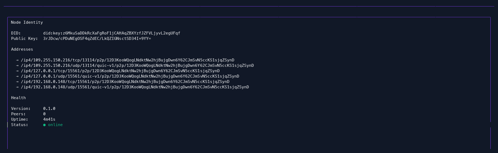
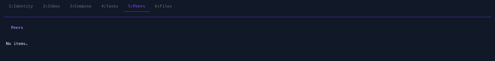

# ADR-0023: A Terminal UI for Daemon Inspection

**Status**: Accepted and implemented
**Date**: 2026-08-21

## Context

Every other way of talking to a running `moltmesh-daemon` is either programmatic (the gRPC API and its SDKs) or a single-shot CLI command (`moltmesh peers`, `moltmesh health`, `moltmesh identity`, …). None of that gives an operator or a developer a live, at-a-glance view of one daemon's state — its identity, its inbox, its in-flight tasks, its connected peers — the way `htop` gives you a live view of a machine instead of a series of `ps` snapshots.

`cmd/tui/main.go` (1,157 lines) and `cmd/moltmesh/tui.go` (1,172 lines) both implement exactly that: a [Bubble Tea](https://github.com/charmbracelet/bubbletea)-based terminal UI, connecting to a daemon's gRPC endpoint and rendering six tabs — Identity, Inbox, Compose, Tasks, Peers, Files — with live auto-refresh. Neither file, nor the terminal UI as a feature, is mentioned in any ADR or in `ARCHITECTURE.md`'s file structure listing. This ADR is that missing write-up, and it also addresses something the write-up process itself surfaced: the two files are not one shared implementation used from two entrypoints, they are two independently-maintained forks of the same original code (a 661-line `diff` between them, including things like one copy defining `styleSuccess`/`styleWarning`/`styleDanger`/`styleMuted` and the other independently redefining the same styles as `styleSuccess2`/`styleWarning2`/`styleDanger2`/`styleMuted2` — with a `// suppress unused warnings` comment next to unused leftovers — the unambiguous signature of a copy-paste fork that then evolved in two directions rather than a factored-out shared package).

## Decision

Keep the terminal UI as a supported feature, exposed two ways, for two different real use cases:

- **`moltmesh tui`** — a subcommand of the main, full-featured `moltmesh` CLI binary (`cmd/moltmesh/tui.go`), for anyone who already has the full CLI installed and wants to drop into a live view without a second binary.
- **`tui`** — a standalone, minimal binary (`cmd/tui/main.go`, listed as its own build target in the `Makefile`'s `BINARIES` list), for anyone who wants to ship or install only the inspection UI — a smaller artifact, no CLI command surface beyond the UI itself.

Both connect over the same gRPC interface any SDK uses (`-grpc-addr`, defaulting to the daemon's Unix socket), so neither one requires any daemon-side awareness that a TUI, specifically, is attached — it is an ordinary gRPC client like the Python or TypeScript SDKs, just one that happens to render its own terminal frames instead of returning values to a caller.

Screenshots below are from a real `moltmesh-daemon` running locally (not mocked output), captured from the standalone `tui` binary attached over TCP to the daemon's gRPC port:

**Identity tab** — the daemon's own DID, public key, advertised multiaddrs, and live health (version, peer count, uptime, status):

**Peers tab** — connected libp2p peers, live-refreshed; shown here against an isolated single daemon with no peers yet connected, which is itself the correct, honestly-rendered empty state rather than staged data:

## Rationale

- **Two entrypoints is a legitimate product decision, not an accident** — a lightweight standalone binary and a subcommand of the full CLI serve genuinely different installation footprints, the same reasoning that justifies `moltmesh`/`daemon`/`tui` all being listed as separate `Makefile` build targets rather than one binary trying to be everything.
- **Two independently-maintained *implementations* of that decision is not equally justified**, and this ADR says so plainly rather than let the fork stand undocumented indefinitely. Every visual or behavioral fix applied to one copy (a color tweak, a new field, a bug fix in how a list renders) has to be manually re-applied to the other, or the two diverge further — which is exactly what has already started happening (the `styleSuccess`/`styleSuccess2` divergence above is evidence of independent edits, not a deliberate design difference).
- **Documenting this now, while the fork is still small enough to read in one `diff`,** is cheaper than documenting it after a third or fourth divergence, which is the same lesson this project's own architecture dissertation draws from the two duplicated daemon-bootstrap entrypoints (ADR-0024).

## Amendment (2026-08-23): `cmd/tui` retired outright

This ADR's original decision kept both entrypoints as a deliberate two-installation-footprint choice. That framing has been superseded: `cmd/tui` has been deleted entirely, not kept alongside `cmd/moltmesh tui` as a lighter-weight alternative.

Before deletion, a feature-parity audit (part of the same bug-sweep-and-refactor pass that also retired `cmd/daemon`, see ADR-0024's amendment) confirmed the tab set was identical between the two forks, but found one real behavioral regression in `cmd/moltmesh/tui.go`'s copy: its `subscribeInbox` opened a brand-new `SubscribeInbox` gRPC stream on every single inbox message (received one message, then discarded the stream), rather than opening the stream once and reusing it the way `cmd/tui/main.go`'s copy did. Since the server replays the whole inbox backlog at stream-open, this meant every new message caused the entire backlog to be re-fetched and re-prepended — an unbounded-duplication bug, not a cosmetic difference. This was fixed by porting `cmd/tui`'s stream-reuse logic (the `inboxStream` field, the `inboxSeen` dedup map, and `newMessageMsg` carrying the stream forward) into `cmd/moltmesh/tui.go` before deleting `cmd/tui`.

This resolves the >600-line fork-divergence problem this ADR documented by elimination rather than by the originally-planned extraction into a shared `internal/tuiapp` package: there is now only one implementation (`cmd/moltmesh/tui.go`), so the "keep both in sync" maintenance burden this ADR flagged no longer applies. The Consequences section's "Follow-up work" (factoring out a shared package) is no longer necessary for that reason.

Anyone who installed the standalone `tui` binary needs to switch to `moltmesh tui`, which is now the only supported terminal UI.

## Consequences

- Until the two implementations are unified, any change to the TUI's behavior, styling, or the tabs it exposes must be applied to *both* `cmd/tui/main.go` and `cmd/moltmesh/tui.go`, or the two binaries will keep drifting apart. This is flagged explicitly as follow-up work below, not accepted as a permanent state.
- **Follow-up work**: factor the shared Bubble Tea model, styles, and tab views into a common internal package (e.g. `internal/tuiapp` or `pkg/tui`), with `cmd/tui/main.go` and `cmd/moltmesh/tui.go` reduced to thin entrypoints that just construct and run it — the same shape ADR-0001 already uses for keeping daemon logic out of `cmd/*` and in shared `daemon/*` packages. This ADR accepts the current forked state as the documented status quo, not as the target end state.
- The terminal UI, like the CLI's other diagnostic commands, is read-mostly against live daemon state and does not introduce any new daemon-side persistence, security boundary, or protocol surface beyond the existing gRPC API — it carries no consequences for durability (Chapter 11 of the project's architecture dissertation) or trust (Chapter 8) beyond whatever the gRPC calls it makes already carry.
